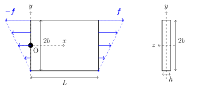
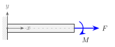
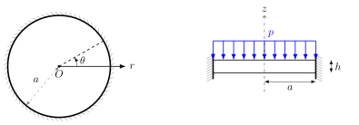
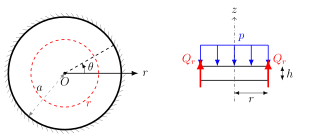
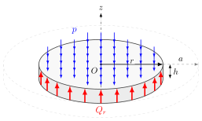
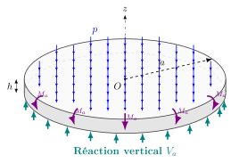
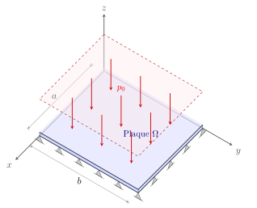
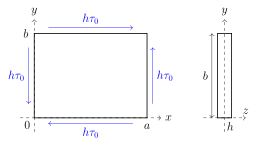
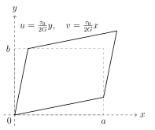

[$\renewcommand{\div}{\operatorname{div}}\newcommand{\bm}[1]{\boldsymbol{#1}}\newcommand{\Hess}{\operatorname{Hess}}\newcommand{\tr}{\operatorname{tr}}\newcommand{\bbR}{\mathbb{R}}\newcommand{\curl}{\operatorname{curl}}$]{style="display:none"}

```{=html}
<div class="sol-toolbar">
  <button class="ab-btn" type="button" data-sol="open"><i class="bi bi-eye"></i> Afficher toutes les solutions</button>
  <button class="ab-btn" type="button" data-sol="close"><i class="bi bi-eye-slash"></i> Tout masquer</button>
</div>
```

Chaque question a sa propre solution repliée : essayez d'abord, puis dépliez. Les encadrés **Simulation** permettent de vérifier les résultats en faisant varier les paramètres.

## Exercice 1 — Traction-flexion d'une plaque mince dans son plan

::: {.figure-panel}
{width="520"}

:::

Une plaque rectangulaire mince, d'épaisseur constante $h$, est soumise au chargement auto-équilibré suivant :

- sur le bord $x = L$ : une force linéique
$$
\bm{f} = \begin{pmatrix} f_x \\ f_y \end{pmatrix} = \begin{pmatrix} Kh(y + b) \\ 0 \end{pmatrix}, \qquad K = \mathrm{const.}
$$
- sur le bord $x = 0$ : la force linéique opposée $-\bm{f}$.

Afin de faciliter la comparaison entre les deux approches, on considère le point $O$ de la plaque fixé en translation selon $x$ et $y$, et en rotation selon $z$.

**Approche plaque**

1. En proposant une expression des efforts internes de plaque (satisfaisant les équations d'équilibre de membrane), rappelez les hypothèses de membrane et vérifiez que cette plaque les satisfait.
2. Exprimez les contraintes en tout point $P(x, y)$, puis les déformations associées.
3. Identifiez les champs de déplacement et de rotation $u(x, y)$, $v(x, y)$, $\theta_z(x, y)$.

**Approche poutre**

4. Proposez un modèle poutre de ce problème avec ses conditions aux limites cinématiques et statiques.
5. Exprimez les efforts internes de poutre $N(x)$, $T_y(x)$, $M_z(x)$ et la contrainte $\sigma_{xx}$.
6. Identifiez la déformée de la poutre ($u(x)$, $v(x)$, $\theta_z(x)$). Comparez avec l'approche plaque et expliquez l'origine des termes supplémentaires.

::: {.callout-note collapse="true"}
## Formulaire
Équilibre statique en deux dimensions :
$$
\div \bm{N}= \bm 0, \qquad
\frac{\partial N_{xx}}{\partial x} + \frac{\partial N_{xy}}{\partial y} = 0, \qquad
\frac{\partial N_{xy}}{\partial x} + \frac{\partial N_{yy}}{\partial y} = 0,
\qquad \bm{N} = \int_{-h/2}^{h/2} \bm{\sigma}\, dz.
$$
Tenseur de déformation :
$$
\bm{\varepsilon} = \tfrac{1}{2}\left(\nabla \bm{u} + (\nabla \bm{u})^\top \right), \qquad
\varepsilon_{xx} = \frac{\partial u}{\partial x}, \quad
\varepsilon_{yy} = \frac{\partial v}{\partial y}, \quad
\varepsilon_{xy} = \frac{1}{2}\left(\frac{\partial u}{\partial y} + \frac{\partial v}{\partial x}\right).
$$
Loi de Hooke en contrainte plane :
$$
\begin{pmatrix} \sigma_{xx} \\ \sigma_{yy} \\ \sigma_{xy} \end{pmatrix}
= \frac{E}{1-\nu^2}
\begin{bmatrix} 1 & \nu & 0 \\ \nu & 1 & 0 \\ 0 & 0 & \frac{1-\nu}{2} \end{bmatrix}
\begin{pmatrix} \varepsilon_{xx} \\ \varepsilon_{yy} \\ 2\varepsilon_{xy} \end{pmatrix}.
$$
En 2D seule la composante $\theta_z$ du vecteur rotation est utilisée :
$$
\bm{\theta} = \tfrac{1}{2} \curl \bm{u}, \qquad
\theta_z = \frac{1}{2}\left(\frac{\partial v}{\partial x} - \frac{\partial u}{\partial y}\right).
$$

:::

::: {.callout-tip collapse="true"}
## Solution Q1 — Efforts internes de plaque
Les efforts de membrane à déterminer sont $N_{xx}, N_{yy}, N_{xy}$. Au vu des conditions aux limites statiques et cinématiques, on propose $N_{yy} = N_{xy} = 0$ et
$$
N_{xx}(x, y) = Kh(y + b).
$$
Ces expressions satisfont les équations d'équilibre de plaque. La plaque est soumise à des efforts selon $x$ et $y$ qui ne varient pas selon $z$ : elle se déforme uniquement dans son plan (membrane), pas en flexion.

:::

::: {.callout-tip collapse="true"}
## Solution Q2 — Contraintes et déformations
La seule contrainte non nulle est la contrainte normale
$$
\sigma_{xx} = \frac{N_{xx}}{h} = K(y + b).
$$
Les déformations découlent de la loi de Hooke :
$$
\varepsilon_{xx} = \frac{\partial u}{\partial x} = \frac{K}{E}(y + b), \qquad
\varepsilon_{yy} = \frac{\partial v}{\partial y} = -\nu \frac{K}{E}(y + b), \qquad
2\varepsilon_{xy} = \frac{\partial u}{\partial y} + \frac{\partial v}{\partial x} = 0.
$$

:::

::: {.callout-tip collapse="true"}
## Solution Q3 — Champs de déplacement
En intégrant les déformations normales :
$$
u(x, y) = \frac{K}{E}(y + b)x + f(y), \qquad
v(x, y) = -\nu \frac{K}{E}\left(\frac{y^2}{2} + by\right) + g(x).
$$
La condition $\varepsilon_{xy}=0$ donne $\frac{Kx}{E} + f'(y) + g'(x) = 0$, soit $\frac{Kx}{E} + g'(x) = -f'(y) = A$ (constante). Après intégration :
$$
\begin{aligned}
u(x, y) &= \frac{K}{E}(y + b)x - Ay + C_1, \\
v(x, y) &= -\nu \frac{K}{E}\left(\frac{y^2}{2} + by\right) + Ax - \frac{K}{E} \frac{x^2}{2} + C_2,
\end{aligned}
$$
$$
\theta_z(x, y) = \frac{1}{2} \left( \frac{\partial v}{\partial x} - \frac{\partial u}{\partial y} \right) = A - \frac{K}{E}x.
$$
Avec $u(0, 0) = v(0, 0) = \theta_z(0, 0) = 0$ on obtient $A = C_1 = C_2 = 0$ :
$$
\begin{aligned}
u(x, y) &= \frac{K}{E}xy + \frac{Kb}{E}x, \\
v(x, y) &= -\frac{K}{E}\frac{x^2}{2} - \nu\frac{K}{E}\frac{y^2}{2} - \nu\frac{Kb}{E}y, \\
\theta_z(x, y) &= -\frac{K}{E}x.
\end{aligned}
$$

:::

::: {.callout-tip collapse="true"}
## Solution Q4 — Modèle poutre
Si $L \gg 2b$, la plaque peut être modélisée comme une poutre de longueur $L$, de section $S = 2bh$ et de moment quadratique $I_z = \frac{h(2b)^3}{12} = \frac{2}{3}b^3h$. Le bord $x = 0$ est encastré ; le bord $x = L$ est soumis au torseur résultant de $f_x$ :

- $F = \int_{-b}^{b} f_x\, dy = KbS$ : effort de traction selon $x$ ;
- $M = \int_{-b}^{b} -y f_x\, dy = -K I_z$ : moment de flexion porté par $z$.

::: {.figure-panel}
{width="380"}

:::
:::

::: {.callout-tip collapse="true"}
## Solution Q5 — Efforts internes et contrainte
Seuls l'effort normal et le moment de flexion sont non nuls : $N(x) = F$, $T_y(x) = 0$, $M_z(x) = M$. La contrainte normale cumule les deux contributions :
$$
\sigma_{xx}(x, y) = \frac{N}{S} - \frac{M_z}{I_{z}}\,y = K(b + y).
$$
On retrouve exactement la contrainte de l'approche plaque.

:::

::: {.callout-tip collapse="true"}
## Solution Q6 — Déformée et comparaison
- Effort normal (allongement) : $u(x, 0) = \int_0^x \varepsilon_{xx}\, dx = \dfrac{F}{ES}x$.
- Moment de flexion : $v'' = \dfrac{M}{EI_z}$, d'où $\theta_z = v' = \dfrac{M}{EI_z}x$ et $v = \dfrac{M}{EI_z}\dfrac{x^2}{2}$.

La rotation de la section droite contribue au déplacement axial : $u(x, y) = u(x,0) - \theta_z\, y$.

| | Plaque | Poutre |
|:-:|:-:|:-:|
| $u(x, y)$ | $\dfrac{Kb}{E}x + \dfrac{K}{E}xy$ | $\dfrac{F}{ES}x - \dfrac{M}{EI_{z}}xy$ |
| $v(x, y)$ | $-\dfrac{K}{E}\dfrac{x^2}{2} - \nu\dfrac{K}{E}\dfrac{y^2}{2} - \nu\dfrac{Kb}{E}y$ | $\dfrac{M}{EI_{z}}\dfrac{x^2}{2}$ |
| $\theta_z(x, y)$ | $-\dfrac{K}{E}x$ | $\dfrac{M}{EI_{z}}x$ |

Avec $F = KbS$ et $M = -KI_z$, on retrouve terme à terme les contributions de l'effort normal et du moment. Les termes supplémentaires de $v(x, y)$ dans l'approche plaque traduisent l'**effet Poisson**, négligé par le modèle poutre.

::: {.pw data-widget="platebeam"}
:::
:::

## Exercice 2 — Disque soumis à un chargement constant

On considère une plaque circulaire encastrée sur son bord extérieur, soumise à une pression uniforme $p$. Les conditions au bord et le chargement ne dépendent pas de $\theta$ : le problème est axisymétrique.

::: {.figure-panel}
{width="600"}

:::

1. En utilisant l'équilibre statique d'un disque de rayon $r$, retrouvez l'effort tranchant $Q_r(r)$.
2. Explicitez les conditions au bord du problème.
3. Obtenez le déplacement vertical.
4. Déduisez-en les réactions à l'encastrement.
5. Comment changent les conditions aux limites pour un appui simple ?

::: {.callout-note collapse="true"}
## Formulaire
Effort tranchant et chargement externe :
$$\frac{1}{r}\frac{d}{dr}(rQ_r) + f_z = 0$$
Effort tranchant et déplacement :
$$
Q_r = -D \frac{d}{dr}\left[\frac{1}{r}\frac{d}{dr}\left(r\frac{dw}{dr}\right)\right] = -D\,\frac{d}{dr}\left(\Delta w\right),
\qquad \Delta(\cdot)=\frac{1}{r}\frac{d}{dr}\left(r\frac{d(\cdot)}{dr}\right).
$$
Effort tranchant et moments : $\;Q_r = \dfrac{1}{r} \left[\dfrac{d}{dr}(rM_{rr}) - M_{\theta\theta}\right]$

Moments en fonction du déplacement :
$$
M_{rr} = - D\left(\frac{d^2w}{dr^2} + \frac{\nu}{r}\frac{dw}{dr}\right), \qquad
M_{\theta\theta} = - D\left(\frac{1}{r}\frac{dw}{dr} + \nu\frac{d^2w}{dr^2}\right).
$$

:::

::: {.callout-tip collapse="true"}
## Solution Q1 — Effort tranchant
On coupe le disque à une distance $r$ du centre :

::: {.figure-panel}
{width="480"}

:::

L'équilibre vertical de la partie centrale donne
$$
2\pi r\, Q_r = p\,\pi r^2 \quad\Longrightarrow\quad Q_r = \frac{pr}{2}.
$$

::: {.figure-panel}
{width="380"}

:::

La réaction verticale à l'encastrement correspond à $r=a$ : $V_a = \dfrac{pa}{2}$. Il restera à calculer la seconde réaction $M_a$ (moment fléchissant au bord).

::: {.figure-panel}
{width="380"}

:::
:::

::: {.callout-tip collapse="true"}
## Solution Q2 — Conditions au bord
L'encastrement bloque le déplacement et la rotation ; avec l'hypothèse de Kirchhoff :
$$
w(a)=0, \qquad \frac{dw}{dr}(a)=0.
$$

:::

::: {.callout-tip collapse="true"}
## Solution Q3 — Déplacement vertical
À partir de $Q_r = -D\,\frac{d}{dr}(\Delta w) = \frac{pr}{2}$, on intègre successivement :
$$
\begin{aligned}
2D\,\frac{1}{r}\frac{d}{dr}\left(r\frac{dw}{dr}\right) &= -p\,\frac{r^2}{2}+A,\\
2D\,r\frac{dw}{dr} &= -\frac{p}{8}\,r^4+\frac{A}{2}\,r^2+B,\\
2Dw &= -\frac{p}{32}\,r^4+\frac{A}{4}\,r^2 + B\ln r+C .
\end{aligned}
$$
Pour éviter $w\to\infty$ en $r=0$ (ou par symétrie, $w'(0)=0$), on impose $B=0$. Les conditions au bord donnent ensuite
$$
\frac{dw}{dr}(a)=0 \;\Rightarrow\; A = \frac{pa^2}{4}, \qquad
w(a)=0 \;\Rightarrow\; C = -\frac{pa^4}{32}.
$$
D'où
$$
w(r) = \frac{p}{2D}\left(-\frac{r^4}{32} + \frac{a^2r^2}{16} - \frac{a^4}{32}\right) = -\frac{p}{64D}\left(r^2-a^2\right)^2 .
$$

:::

::: {.callout-tip collapse="true"}
## Solution Q4 — Réactions à l'encastrement
Avec les lois moment–déplacement :
$$
M_{rr}(r)=-\frac{p}{16}\left[a^2(1+\nu) - r^2(3+\nu)\right], \qquad
M_{\theta\theta}(r)=-\frac{p}{16}\left[a^2(1+\nu) - r^2(1+3\nu)\right].
$$
À l'encastrement :
$$
M_{rr}(a)=\frac{pa^2}{8}, \qquad M_{\theta\theta}(a)=\nu\,\frac{pa^2}{8}, \qquad V_a = \frac{pa}{2}.
$$

:::

::: {.callout-tip collapse="true"}
## Solution Q5 — Appui simple
La rotation est libre et le moment fléchissant est nul :
$$
w(a)=0, \qquad M_{rr}(a)=0.
$$

:::

## Exercice 3 — Solution de Navier d'une plaque simplement appuyée {#sec-navier}

On considère une plaque mince rectangulaire de Kirchhoff–Love sur $\Omega = [0, a] \times [0, b]$, de rigidité $D = \frac{Eh^3}{12(1-\nu^2)}$. Sous une charge transversale $q(x, y)$ (dans le sens $+z$), la flèche vérifie
$$
D \Delta^2 w = q, \qquad \Delta^2 = \frac{\partial^4}{\partial x^4} + 2\frac{\partial^4}{\partial x^2 \partial y^2} + \frac{\partial^4}{\partial y^4}.
$$
La plaque est **simplement appuyée** sur ses quatre côtés.

::: {.figure-panel}
{width="420"}

:::

1. Écrivez explicitement les conditions aux limites pour $w(x, y)$ le long des bords $x=0$, $x=a$, $y=0$ et $y=b$.
2. Calculez la solution analytique $w(x, y)$ sous une charge uniforme $q = -p_0$.
3. *(Bonus)* La charge uniforme est remplacée par une force ponctuelle $F_0$ en $(x^*, y^*) \in \Omega$. Déterminez $w(x, y)$.

::: {.callout-note collapse="true"}
## Suggestion : méthode de Navier
Développez la charge et le déplacement en double série de Fourier, sur les fonctions propres du bi-laplacien avec conditions d'appui simple ($\Delta^2 \phi = \lambda \phi$) :
$$
w(x, y) = \sum_{m=1}^{\infty} \sum_{n=1}^{\infty} W_{mn} \sin\left(\frac{m\pi x}{a}\right) \sin\left(\frac{n\pi y}{b}\right).
$$
Exploitez l'orthogonalité de la base pour isoler les coefficients $W_{mn}$, et faites de même pour $q(x, y)$.

:::

::: {.callout-note collapse="true"}
## Rappel : orthogonalité de la base de Fourier
$$
\int_0^a \sin\left(\frac{m\pi x}{a}\right) \sin\left(\frac{k\pi x}{a}\right) dx = \frac{a}{2} \delta_{mk},
\qquad \delta_{mk} = \begin{cases} 1 & m=k \\ 0 & \text{sinon} \end{cases}
$$
**Démonstration.** Avec $\sin\alpha\sin\beta = \frac{1}{2}\left[\cos(\alpha-\beta) - \cos(\alpha+\beta)\right]$ :
$$
\int_0^a \sin\left(\frac{m\pi x}{a}\right) \sin\left(\frac{k\pi x}{a}\right) dx = \frac{1}{2} \int_0^a \left[ \cos\left(\frac{(m-k)\pi x}{a}\right) - \cos\left(\frac{(m+k)\pi x}{a}\right) \right] dx .
$$

- Si $m \neq k$ : $(m\pm k)$ sont des entiers non nuls ; les primitives $\frac{a}{(m\pm k)\pi}\sin\frac{(m\pm k)\pi x}{a}$ s'annulent en $0$ et en $a$, donc l'intégrale est nulle.
- Si $m = k$ : $\frac{1}{2}\int_0^a \left[1-\cos\frac{2m\pi x}{a}\right]dx = \frac{1}{2}\left[x - \frac{a}{2m\pi}\sin\frac{2m\pi x}{a}\right]_0^a = \frac{a}{2}$.

Le même résultat s'applique *mutatis mutandis* sur $[0, b]$.

:::

::: {.callout-tip collapse="true"}
## Solution Q1 — Conditions aux limites
Appui simple : flèche nulle et moment de flexion normal nul, avec
$M_{xx} = -D \left( \partial_{xx} w + \nu \partial_{yy} w \right)$, $M_{yy} = -D \left( \partial_{yy} w + \nu \partial_{xx} w \right)$ :
$$
\begin{aligned}
x=0,\ x=a :&\quad w = 0, \quad M_{xx} = 0 \;\Rightarrow\; \partial_{xx} w = 0, \\
y=0,\ y=b :&\quad w = 0, \quad M_{yy} = 0 \;\Rightarrow\; \partial_{yy} w = 0 .
\end{aligned}
$$
Comme $w=0$ le long de $x\in\{0,a\}$, $\partial_{yy}w$ y est nulle aussi, et $M_{xx}=0$ se réduit à $\partial_{xx} w = 0$ (idem en $y$). Les conditions sont **découplées** : on cherche $f(x)$ nulle ainsi que $f''$ en $x\in\{0,a\}$, et $g(y)$ de même en $y\in\{0,b\}$. Les sinus conviennent :
$$
f(x) = \sin\left(\frac{m\pi x}{a}\right), \qquad g(y) = \sin\left(\frac{n\pi y}{b}\right).
$$

:::

::: {.callout-tip collapse="true"}
## Solution Q2 — Charge uniforme
Avec $\phi_{mn} = \sin(\alpha_m x) \sin(\beta_n y)$, $\alpha_m = \frac{m\pi}{a}$, $\beta_n = \frac{n\pi}{b}$ :
$$
\Delta^2 \phi_{mn} = \left( \alpha_m^2 + \beta_n^2 \right)^2 \phi_{mn} = \pi^4 \left[ \left(\tfrac{m}{a}\right)^2 + \left(\tfrac{n}{b}\right)^2 \right]^2 \phi_{mn} .
$$
En développant $w = \sum W_{mn}\phi_{mn}$ et $q = \sum Q_{mn}\phi_{mn}$ dans $D \Delta^2 w = q$, puis en projetant sur le mode $(k,l)$ (orthogonalité, facteur $\frac{ab}{4}$), on obtient
$$
W_{mn} = \frac{Q_{mn}}{D \pi^4 \left[ \left(\frac{m}{a}\right)^2 + \left(\frac{n}{b}\right)^2 \right]^2},
\qquad
Q_{mn} = \frac{4}{ab} \int_0^a \!\!\int_0^b q(x, y)\, \phi_{mn}\, dx\,dy .
$$
Pour $q = -p_0$, l'intégrale se factorise, avec $\int_0^a \sin\frac{m\pi x}{a}\,dx = \frac{a}{m\pi}\left(1 - (-1)^m\right)$ :
$$
Q_{mn} = \begin{cases} -\dfrac{16 p_0}{\pi^2 m n} & m, n \text{ impairs} \\ 0 & \text{sinon} \end{cases}
$$
d'où la solution
$$
w(x, y) = -\frac{16 p_0}{\pi^6 D} \sum_{m=1,3,\dots} \;\sum_{n=1,3,\dots} \frac{\sin\left(\frac{m\pi x}{a}\right) \sin\left(\frac{n\pi y}{b}\right)}{mn \left[ \left(\frac{m}{a}\right)^2 + \left(\frac{n}{b}\right)^2 \right]^2}.
$$
Pour une plaque carrée, $w_{\max} \approx 0{,}00406\, p_0a^4/D$. Explorez la convergence de la série :

::: {.pw data-widget="navier" data-load="u"}
:::
:::

::: {.callout-tip collapse="true"}
## Solution Q3 — Force ponctuelle (bonus)
On modélise la charge par une distribution de Dirac, $q(x, y) = -F_0\, \delta(x - x^*)\, \delta(y - y^*)$, avec $\int_0^a f(x)\delta(x-x^*)\,dx = f(x^*)$. La même projection donne
$$
Q_{mn} = -\frac{4F_0}{ab} \sin\left(\frac{m\pi x^*}{a}\right) \sin\left(\frac{n\pi y^*}{b}\right),
$$
$$
w(x, y) = -\frac{4F_0}{ab\, D \pi^4} \sum_{m=1}^{\infty} \sum_{n=1}^{\infty} \frac{\sin\left(\frac{m\pi x^*}{a}\right) \sin\left(\frac{n\pi y^*}{b}\right)}{\left[ \left(\frac{m}{a}\right)^2 + \left(\frac{n}{b}\right)^2 \right]^2} \sin\left(\frac{m\pi x}{a}\right) \sin\left(\frac{n\pi y}{b}\right).
$$
Cliquez sur la plaque pour déplacer la force :

::: {.pw data-widget="navier" data-load="p"}
:::
:::

## Exercice 4 — Travail à la maison : cisaillement pur

On considère une plaque rectangulaire homogène, isotrope, élastique linéaire (module d'Young $E$, module de cisaillement $G$, coefficient de Poisson $\nu$), de dimensions $a$ selon $x$ et $b$ selon $y$. Elle est soumise à des forces linéiques tangentielles uniformes imposant un état de cisaillement pur :
$$
\bm{f} = -h\tau_0\, \bm{e}_y \text{ sur } x=0, \qquad
\bm{f} = +h\tau_0\, \bm{e}_y \text{ sur } x=a, \qquad
\bm{f} = -h\tau_0\, \bm{e}_x \text{ sur } y=0, \qquad
\bm{f} = +h\tau_0\, \bm{e}_x \text{ sur } y=b.
$$

::: {.figure-panel}
{width="460"}

:::

1. Montrez que le champ de contraintes est un cisaillement pur uniforme.
2. Déterminez les déformations.
3. Trouvez un champ de déplacements. Quelles hypothèses faut-il introduire pour fixer le mouvement rigide ?
4. Donnez les contraintes principales.

::: {.callout-tip collapse="true"}
## Solution Q1 — Champ de contraintes
On cherche un champ statiquement admissible et uniforme : $N_{xx} = 0$, $N_{yy} = 0$, $N_{xy} = h\tau_0$. Il vérifie trivialement
$\partial_x N_{xx} + \partial_y N_{xy} = 0$ et $\partial_x N_{xy} + \partial_y N_{yy} = 0$. La seule composante active est $\sigma_{xy} = \tau_0$.

:::

::: {.callout-tip collapse="true"}
## Solution Q2 — Déformations
Pour un matériau isotrope, $\sigma_{xy} = G \gamma_{xy}$, donc
$$
\gamma_{xy} = \frac{\tau_0}{G}, \qquad \varepsilon_{xx} = \varepsilon_{yy} = 0.
$$

:::

::: {.callout-tip collapse="true"}
## Solution Q3 — Déplacements
$\varepsilon_{xx} = \partial_x u = 0 \Rightarrow u = f(y)$ et $\varepsilon_{yy} = \partial_y v = 0 \Rightarrow v = g(x)$. Le cisaillement impose $f'(y) + g'(x) = \tau_0/G$ : chaque terme est constant,
$f'(y) = A$, $g'(x) = \tau_0/G - A$, d'où
$$
u(x,y) = Ay + C_1, \qquad v(x,y) = \left(\frac{\tau_0}{G} - A\right)x + C_2 .
$$
Pour fixer le mouvement rigide, on bloque le point $(0, 0)$ en translation ($C_1 = C_2 = 0$) et en rotation :
$\theta_z = \frac{1}{2}\left(\partial_x v - \partial_y u\right) = \frac{1}{2}\left(\frac{\tau_0}{G}-2A\right) = 0 \Rightarrow A=\frac{\tau_0}{2G}$. Ainsi
$$
u(x,y) = \frac{\tau_0}{2G}\,y, \qquad v(x,y) = \frac{\tau_0}{2G}\,x .
$$

::: {.figure-panel}
{width="340"}

:::
:::

::: {.callout-tip collapse="true"}
## Solution Q4 — Contraintes principales
$$
\bm{\sigma} = \begin{pmatrix} 0 & \tau_0 \\ \tau_0 & 0 \end{pmatrix}
\quad\Longrightarrow\quad \sigma_1 = \tau_0, \qquad \sigma_2 = -\tau_0,
$$
avec des directions principales inclinées à $45^\circ$.

:::
