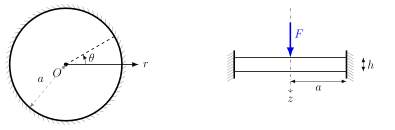
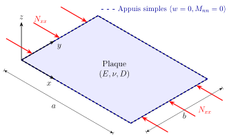

[$\renewcommand{\div}{\operatorname{div}}\newcommand{\bm}[1]{\boldsymbol{#1}}\newcommand{\Hess}{\operatorname{Hess}}\newcommand{\tr}{\operatorname{tr}}\newcommand{\bbR}{\mathbb{R}}\newcommand{\curl}{\operatorname{curl}}$]{style="display:none"}

```{=html}
<div class="sol-toolbar">
  <button class="ab-btn" type="button" data-sol="open"><i class="bi bi-eye"></i> Afficher toutes les solutions</button>
  <button class="ab-btn" type="button" data-sol="close"><i class="bi bi-eye-slash"></i> Tout masquer</button>
</div>
```

Chaque question a sa propre solution repliée : essayez d'abord, puis dépliez. Les encadrés **Simulation** refont les calculs de Ritz en direct.

## Exercice 1 — Plaque circulaire soumise à une force concentrée

Soit une plaque circulaire mince de rayon $a$ et de rigidité $D$, **encastrée** sur tout son contour ($r = a$) et soumise à une force ponctuelle $F$ en son centre. On approche la flèche $w(r)$ par la méthode de Ritz avec la fonction de base
$$
\phi(r) = \left(1 - \frac{r^2}{a^2}\right)^2, \qquad w(r) = c\, \phi(r),
$$
où $c$ est le paramètre de Ritz à déterminer.

::: {.figure-panel}
{width="600"}

:::

1. Vérifiez que la fonction de base satisfait les conditions aux limites cinématiques.
2. Calculez l'énergie de déformation.
3. Calculez le travail de la force.
4. Calculez le paramètre de Ritz $c$ en minimisant l'énergie potentielle.
5. Comment la méthode se modifie-t-elle avec deux fonctions de base, $w(r) = c_1 \phi_1(r) + c_2 \phi_2(r)$ ?
$$
\phi_1(r) = \left(1 - \frac{r^2}{a^2}\right)^2, \qquad \phi_2(r) = \left(1 - \frac{r^2}{a^2}\right)^3
$$

::: {.callout-note collapse="true"}
## Formulaire
Énergie de flexion d'une plaque isotrope :
$$
U = \frac{D}{2} \int_{\Omega} \left[ (\Delta w)^2 - 2(1-\nu) \det(\Hess w) \right] d\Omega .
$$
En coordonnées polaires et dans le cas axisymétrique ($\partial_\theta = 0$) :
$$
U = \pi D \int_{0}^{a} \left[ \left( \frac{d^2w}{dr^2} + \frac{1}{r}\frac{dw}{dr} \right)^2 - 2(1-\nu)\frac{1}{r}\frac{dw}{dr}\frac{d^2w}{dr^2} \right] r \, dr .
$$
*Remarque* : le second terme est une dérivée totale, $\;\dfrac{dw}{dr}\dfrac{d^2w}{dr^2} = \dfrac{1}{2} \dfrac{d}{dr} \left[ \left(\dfrac{dw}{dr}\right)^2 \right]$.

**Solution analytique** pour une force concentrée $F$ :
$$
\begin{aligned}
w(r) &= \frac{Fa^2}{16\pi D}\left[1 - \frac{r^2}{a^2} + 2 \frac{r^2}{a^2}\ln\left(\frac{r}{a}\right)\right], \\
M_{rr} &= -\frac{F}{4\pi}\left[1 +(1+\nu)\ln\left(\frac{r}{a}\right)\right], \qquad
M_{\theta\theta} = -\frac{F}{4\pi}\left[\nu +(1+\nu)\ln\left(\frac{r}{a}\right)\right].
\end{aligned}
$$

:::

::: {.callout-tip collapse="true"}
## Solution Q1 — Conditions aux limites
Encastrement en $r=a$ : $w(a)=0$ et $w'(a)=0$.
$$
w(a) = c\,(1 - 1)^2 = 0, \qquad
\frac{dw}{dr} = -\frac{4c}{a^2}\, r \left(1 - \frac{r^2}{a^2}\right) \;\Rightarrow\; \left.\frac{dw}{dr}\right|_{r=a} = 0 .
$$
La fonction est cinématiquement admissible. On note aussi $w'(0) = 0$ : indispensable pour la régularité et la symétrie au centre.

:::

::: {.callout-tip collapse="true"}
## Solution Q2 — Énergie de déformation
Le terme de Gauss est une dérivée totale :
$$
I_2 = \int_{0}^{a} \frac{1}{r}\frac{dw}{dr}\frac{d^2w}{dr^2}\, r \, dr = \frac{1}{2} \left[ \left(\frac{dw}{dr}\right)^2 \right]_{0}^{a} = 0,
$$
puisque la pente est nulle en $r=a$ et en $r=0$. Il reste $U = \pi D \int_{0}^{a} (\Delta w)^2\, r \, dr$ avec
$$
\frac{dw}{dr} = -\frac{4c}{a^2}r + \frac{4c}{a^4}r^3, \qquad
\frac{d^2w}{dr^2} = -\frac{4c}{a^2} + \frac{12c}{a^4}r^2, \qquad
\Delta w = \frac{8c}{a^2} \left( 2\frac{r^2}{a^2} - 1 \right).
$$
$$
U = \pi D \frac{64c^2}{a^4} \int_{0}^{a} \left( 4\frac{r^5}{a^4} - 4\frac{r^3}{a^2} + r \right) dr
= \pi D \frac{64c^2}{a^4}\cdot\frac{a^2}{6} = \frac{32\pi D}{3a^2}\, c^2 .
$$

:::

::: {.callout-tip collapse="true"}
## Solution Q3 — Travail de la force
La force est appliquée en $r=0$ : $\;W = F\, w(0) = F c$.

:::

::: {.callout-tip collapse="true"}
## Solution Q4 — Paramètre de Ritz
$$
\Pi(c) = \frac{32\pi D}{3a^2}\, c^2 - F c, \qquad
\frac{d\Pi}{dc} = \frac{64\pi D}{3a^2}\, c - F = 0 \;\Longrightarrow\; c = \frac{3Fa^2}{64\pi D} = \frac{9Fa^2(1-\nu^2)}{16\pi Eh^3}.
$$
Le paramètre $c$ est la flèche au centre. La solution exacte vaut $w(0) = \dfrac{Fa^2}{16\pi D} = \dfrac{4Fa^2}{64\pi D}$ : Ritz donne exactement **75 %** de la valeur réelle. Cette sous-estimation (sur-rigidification) est typique de Ritz avec une base polynomiale simple, incapable de capturer la singularité $r^2\ln r$ de la solution exacte.

:::

::: {.callout-tip collapse="true"}
## Solution Q5 — Deux fonctions de base
$\phi_1$ et $\phi_2$ vérifient chacune $w=0$ et $w'=0$ en $r=a$. L'énergie étant quadratique, $\Pi(c_1, c_2)$ est un paraboloïde ; on annule son gradient, $\partial\Pi/\partial c_1 = \partial\Pi/\partial c_2 = 0$, ce qui donne un système $2\times2$ :
$$
\begin{bmatrix} K_{11} & K_{12} \\ K_{21} & K_{22} \end{bmatrix} \begin{bmatrix} c_1 \\ c_2 \end{bmatrix} = \begin{bmatrix} f_1 \\ f_2 \end{bmatrix},
\qquad K_{ij} = 2\pi D \int_{0}^{a} \Delta\phi_i\, \Delta\phi_j \, r \, dr, \qquad f_i = F\, \phi_i(0) .
$$
$\mathbf K$ est symétrique définie positive. Le calcul donne
$$
\mathbf K = \frac{\pi D}{a^2}\begin{bmatrix} 64/3 & 16 \\ 16 & 96/5 \end{bmatrix},
\qquad c_1 = \frac{Fa^2}{48\pi D}, \quad c_2 = \frac{5Fa^2}{144\pi D},
$$
soit $w(0) = c_1 + c_2 = \frac{8}{9}\,w_{\rm exact}(0)$ : l'enrichissement fait passer de 75 % à 89 %. Ajoutez des fonctions :

::: {.pw data-widget="diskritz"}
:::
:::

## Exercice 2 — Flambement par la méthode de Rayleigh–Ritz {#sec-ritz-buckling}

Une plaque rectangulaire $a \times b$, simplement appuyée sur tout son contour, de rigidité $D$, est soumise à une compression uniforme $N_{xx}^{\rm comp}$ sur les bords $x=0$ et $x=a$ (ici prise **positive en compression**). Le phénomène est gouverné par
$$
D\Delta^2 w = -N_{xx}^{\rm comp}\,\frac{\partial^2 w}{\partial x^2}.
$$
L'énergie de déformation et le travail de la compression valent
$$
U = \frac{D}{2} \int_0^a \!\!\int_0^b \left\{ (\Delta w)^2 - 2(1-\nu) \det(\Hess w)\right\} dx\,dy, \qquad
W = \frac{1}{2} \int_0^a \!\!\int_0^b N_{xx}^{\rm comp} (\partial_x w)^2 \, dx \, dy,
$$
avec $\det \Hess w = \partial_{xx} w\, \partial_{yy} w - (\partial_{xy} w)^2$.

::: {.figure-panel}
{width="520"}

:::

1. Montrez que pour une plaque rectangulaire avec $w=0$ sur le contour, le terme $\int\det \Hess w$ (courbure de Gauss linéarisée) est nul. *Suggestion :*
$$
\partial_{xx} w\, \partial_{yy} w - (\partial_{xy} w)^2 = \frac{\partial}{\partial x} \left( \partial_x w\, \partial_{yy} w \right) - \frac{\partial}{\partial y} \left( \partial_x w\, \partial_{xy} w \right).
$$
2. Par Rayleigh–Ritz, évaluez la charge critique $N^{\mathrm{cr}}_{\mathrm{p}}$ avec le polynôme $w_{\mathrm{p}}(x,y) = x y\,(x-a)(y-b)$.
3. Calculez $N^{\mathrm{cr}}_{\mathrm{s}}$ avec le double sinus $w_{\mathrm{s}}(x,y) = \sin\left(\frac{\pi x}{a}\right) \sin\left(\frac{\pi y}{b}\right)$.
4. Pour une plaque carrée ($a = b$), évaluez l'écart relatif entre les deux charges et commentez-le à la lumière des conditions aux limites.
5. Avec les modes $w_{mn} = \sin\left(\frac{m \pi x}{a}\right) \sin\left(\frac{n\pi y}{b}\right)$, évaluez la charge critique pour un rapport $a/b$ fixé. *Suggestion :* minimisez par rapport à $m$ et $n$.

::: {.callout-note collapse="true"}
## Rappel : valeurs propres et quotient de Rayleigh
En théorie linéaire, le flambement est un problème aux valeurs propres généralisé : la charge critique $N^{\rm cr}$ est la plus petite valeur de $N_{xx}^{\rm comp}$ pour laquelle $D\Delta^2 w = -N_{xx}^{\rm comp}\,\partial_{xx} w$ admet une solution non nulle.

Le quotient de Rayleigh est intimement lié aux valeurs propres (voir [la méthode de Rayleigh–Ritz](https://en.wikipedia.org/wiki/Rayleigh%E2%80%93Ritz_method), ou en génie civil @lu2025ritz). Avec $U$ l'énergie de déformation et $W$ le travail d'une compression unitaire :
$$
R(w) = \frac{U}{W}, \qquad W = \frac{1}{2} \int_0^a \!\!\int_0^b \left(\partial_x w\right)^2 dx\,dy, \qquad N^{\mathrm{cr}} = \min_w R(w).
$$
On approche le mode de flambement par une approximation de Ritz — d'où le nom **Rayleigh–Ritz**.

Le numérateur $U$ représente la *résistance interne* (énergie de flexion stockée) ; le dénominateur $W$, le *potentiel d'activation* du chargement. À $N_{xx} = N^{\rm cr}$, le travail de la compression compense exactement l'énergie élastique de flexion : le système bascule d'un état stable (plan) à un état neutre ($\Pi = 0$).

:::

::: {.callout-tip collapse="true"}
## Solution Q1 — Annulation du terme de Gauss
L'intégrande s'écrit comme une divergence :
$$
I_G = \int_\Omega \nabla \cdot \begin{pmatrix} \partial_x w\, \partial_{yy} w \\ -\partial_x w\, \partial_{xy}w \end{pmatrix} d\Omega
= \oint_{\Gamma} \bm{n} \cdot \begin{pmatrix} \partial_x w\, \partial_{yy} w \\ -\partial_x w\, \partial_{xy}w \end{pmatrix} ds .
$$

- **Bords $y=0$ et $y=b$** : l'intégrande est $\mp\,\partial_x w\, \partial_{xy}w$. Comme $w(x,0) = w(x,b) = 0$, la dérivée tangentielle $\partial_x w$ y est nulle.
- **Bords $x=0$ et $x=a$** : l'intégrande est $\pm\,\partial_x w\, \partial_{yy}w$. Comme $w(0,y) = w(a,y) = 0$, la dérivée seconde tangentielle $\partial_{yy} w$ est nulle.

Donc $I_G = 0$ : pour $w=0$ sur le contour, $\nu$ disparaît de l'énergie.

:::

::: {.callout-tip collapse="true"}
## Solution Q2 — Approximation polynomiale
Avec $w_{\mathrm{p}} = (x^2 - ax)(y^2 - by)$, l'énergie a été calculée à l'exercice 3 :
$U = D\, ab \left( \frac{a^4 + b^4}{15} + \frac{a^2b^2}{9} \right)$.
Pour le travail, $\partial_x w_{\mathrm{p}} = (2x - a)(y^2 - by)$ et
$$
\int_{0}^{a} (2x - a)^2 \, dx = \frac{a^3}{3}, \qquad
\int_0^b(y^2 - by)^2\, dy = \frac{b^5}{30}
\quad\Longrightarrow\quad W = \frac{1}{2}\cdot\frac{a^3}{3}\cdot\frac{b^5}{30} = \frac{a^3b^5}{180}.
$$
$$
N^{\mathrm{cr}}_{\mathrm{p}} = \frac{U}{W} = \frac{D}{b^2} \left( 12\frac{b^2}{a^2} + 12\frac{a^2}{b^2} + 20 \right).
$$

:::

::: {.callout-tip collapse="true"}
## Solution Q3 — Approximation trigonométrique
L'énergie (exercice 3) vaut $U = \frac{D ab \pi^4}{8}\left(\frac{1}{a^2} + \frac{1}{b^2}\right)^2$. Avec $\int_0^a \cos^2\frac{\pi x}{a}\,dx = \frac{a}{2}$ et $\int_0^b \sin^2\frac{\pi y}{b}\,dy = \frac{b}{2}$ :
$$
W = \frac{1}{2}\cdot\frac{\pi^2}{a^2}\cdot\frac{a}{2}\cdot\frac{b}{2} = \frac{\pi^2 b}{8a}
\quad\Longrightarrow\quad
N^{\mathrm{cr}}_{\mathrm{s}} = \frac{\pi^2 D}{b^2}\left(\frac{b}{a} + \frac{a}{b}\right)^2 .
$$

:::

::: {.callout-tip collapse="true"}
## Solution Q4 — Plaque carrée
Pour $a = b$ :
$$
N^{\mathrm{cr}}_{\mathrm{p}} = \frac{44D}{a^2}, \qquad N^{\mathrm{cr}}_{\mathrm{s}} = \frac{4\pi^2 D}{a^2} \approx \frac{39{,}48\,D}{a^2},
\qquad e = \frac{44 - 4\pi^2}{4\pi^2} \approx 11{,}45\,\%.
$$
Le double sinus est la **solution exacte** (Navier). Le polynôme est admissible ($w=0$ au bord) mais ne satisfait pas la condition naturelle de moment nul ($\partial_{xx} w_{\mathrm{p}} \neq 0$ sur les bords chargés). Restreindre l'espace des solutions revient à ajouter une rigidité artificielle : Rayleigh–Ritz **surestime toujours** la charge critique. Enrichissez la base polynomiale pour voir la convergence :

::: {.pw data-widget="rrconv" data-alpha="1"}
:::
:::

::: {.callout-tip collapse="true"}
## Solution Q5 — Modes successifs
Avec $w_{mn}$, les mêmes intégrations donnent
$$
N^{\mathrm{cr}}(m,n) = \frac{\pi^2 D}{b^2} \left(\frac{mb}{a} + \frac{n^2 a}{mb}\right)^2 .
$$
$n$ n'apparaît qu'au numérateur d'un terme positif : le minimum est atteint pour $n = 1$ (une seule demi-onde transversalement à la compression). Avec $\alpha = a/b$ :
$$
N^{\mathrm{cr}}(m) = \frac{\pi^2 D}{b^2} \left(\frac{m}{\alpha} + \frac{\alpha}{m}\right)^2,
\qquad \frac{\partial}{\partial m}\left(\frac{m}{\alpha} + \frac{\alpha}{m}\right) = 0 \;\Rightarrow\; m = \alpha .
$$
Le minimum, atteint pour $m = \alpha$ entier, est indépendant de la longueur $a$ :
$$
N^{\mathrm{cr}}_{\mathrm{min}} = \frac{4\pi^2 D}{b^2}.
$$
Entre deux entiers, le mode critique passe de $m$ à $m+1$ demi-ondes en $\alpha=\sqrt{m(m+1)}$ :

::: {.pw data-widget="buckling" data-alpha="1.6"}
:::

::: {.figure-panel}
{width="640"}

:::
:::

## Exercice 3 — Travail à la maison : plaque appuyée revisitée {#sec-ssss-ritz}

On reprend le cadre de l'[exercice de Navier](pc1.qmd#sec-navier) : plaque mince rectangulaire $a \times b$ simplement appuyée, de rigidité $D$ et coefficient de Poisson $\nu$, sous pression uniforme $p_0$. L'énergie potentielle totale est $\Pi = U - W$ avec
$$
U = \frac{D}{2} \int_0^a \!\!\int_0^b \left\{ (\Delta w)^2 - 2(1-\nu) \det(\Hess w)\right\} dx\,dy, \qquad
W = \int_0^a \!\!\int_0^b p_0 \, w(x,y) \, dx \, dy .
$$

1. On résout le problème par Ritz avec une fonction de forme unique $\phi(x,y) = x y (x-a)(y-b)$. Vérifiez que $w_{\mathrm{app}} = c \, \phi$ est admissible.
2. Évaluez $\Pi(w_{\mathrm{app}})$.
3. Déduisez-en l'amplitude $c$.
4. Que se passe-t-il si la fonction d'essai est un double sinus $\phi(x,y) = \sin\left(\frac{\pi m x}{a}\right) \sin\left(\frac{\pi n y}{b}\right)$ ?

::: {.callout-tip collapse="true"}
## Solution Q1 — Admissibilité
Les conditions essentielles de l'appui simple sont $w = 0$ sur le contour :
$w_{\mathrm{app}}(0,y) = w_{\mathrm{app}}(a,y) = 0$ et $w_{\mathrm{app}}(x,0) = w_{\mathrm{app}}(x,b) = 0$. La fonction est admissible.

*Remarque préliminaire* : $w=0$ sur tout le contour, donc $\int\det\Hess w = 0$ (exercice 2) et
$U = \frac{D}{2} \int_0^a \!\int_0^b (\Delta w)^2 dx\,dy$.

:::

::: {.callout-tip collapse="true"}
## Solution Q2 — Énergie potentielle
$\partial_{xx} w_{\mathrm{app}} = 2c(y^2 - by)$, $\partial_{yy} w_{\mathrm{app}} = 2c(x^2 - ax)$, donc
$(\Delta w_{\mathrm{app}})^2 = 4c^2 \left[ (y^2 - by)^2 + (x^2 - ax)^2 + 2(x^2 - ax)(y^2 - by) \right]$. Avec
$$
\int_0^a (x^2 - ax) \, dx = -\frac{a^3}{6}, \qquad \int_0^a (x^2 - ax)^2 \, dx = \frac{a^5}{30}
$$
(et de même en $y$) :
$$
U = 2D c^2 ab \left( \frac{a^4 + b^4}{30} + \frac{a^2b^2}{18} \right), \qquad
W = p_0 c \left(-\frac{a^3}{6}\right)\left(-\frac{b^3}{6}\right) = p_0 c\, \frac{a^3b^3}{36}.
$$

:::

::: {.callout-tip collapse="true"}
## Solution Q3 — Amplitude
$\partial\Pi/\partial c = 0$ donne $4D c \, ab\, \dfrac{3a^4 + 3b^4 + 5a^2b^2}{90} = p_0 \dfrac{a^3b^3}{36}$, soit
$$
c = \frac{5 \, p_0 a^2 b^2}{8D (3a^4 + 3b^4 + 5a^2b^2)} .
$$
Pour une plaque carrée, au centre :
$$
w_{\mathrm{app}}^{\max} = \frac{5 p_0 a^4}{1408\,D} \approx 0{,}00355\,\frac{p_0a^4}{D}
\qquad\text{contre}\qquad w^{\max}_{\mathrm{ex}} \approx 0{,}00406\,\frac{p_0a^4}{D}.
$$
Ritz à un terme prédit une flèche plus faible (structure plus rigide), en accord avec le caractère de borne des méthodes énergétiques en déplacement. Testez d'autres conditions aux limites :

::: {.pw data-widget="ritz1"}
:::
:::

::: {.callout-tip collapse="true"}
## Solution Q4 — Base en double sinus
Le double sinus est fonction propre du problème appuyé :
$\Delta \phi = -k^2 \phi$ avec $k^2 = \pi^2\left(\frac{m^2}{a^2}+\frac{n^2}{b^2}\right)$. Alors
$$
U = \frac{D}{2}c^2 k^4 \int_0^a\!\!\int_0^b \phi^2 = \frac{D\,c^2 k^4}{8}\,ab, \qquad
W = p_0 c\, \frac{a}{m\pi}(1-\cos m\pi)\,\frac{b}{n\pi}(1-\cos n\pi),
$$
nul si $m$ ou $n$ est pair, et égal à $\frac{4ab\,p_0}{\pi^2 mn}\, c$ sinon. La minimisation donne
$$
c = \frac{16\,p_0}{\pi^6\, mn\, D\left(\dfrac{m^2}{a^2}+\dfrac{n^2}{b^2}\right)^2} \qquad (m,n \text{ impairs}),
$$
exactement le coefficient de Fourier de la solution de Navier : Ritz redonne la solution exacte lorsque la base contient les modes propres.

:::

## Références {.unnumbered}

::: {#refs}
:::
