## Plan du cours

[$\renewcommand{\div}{\operatorname{div}}\newcommand{\bm}[1]{\boldsymbol{#1}}\newcommand{\Hess}{\operatorname{Hess}}\newcommand{\tr}{\operatorname{tr}}\newcommand{\bbR}{\mathbb{R}}\newcommand{\curl}{\operatorname{curl}}$]{style="display:none"}

{fig-align="center" width="1100"}

::: {.remarque}
Références principales : @reddy2006theory ; @ventsel2001thinplates.

:::

::: {.small .muted}
Astuces : <kbd>F</kbd> plein écran · <kbd>O</kbd> vue d'ensemble · <kbd>M</kbd> menu · <kbd>E</kbd> export PDF · <kbd>B</kbd> tableau noir. Les encadrés **Simulation** sont interactifs.

:::

## Notations

| | | |
|:--|:--|:--|
| [Gradient]{.hlp} | $\nabla f=\partial_i f\,\bm e_i$ | $\nabla\bm v=\partial_j v_i\;\bm e_i\otimes\bm e_j$ |
| [Gradient symétrisé]{.hlp} | $\nabla^s\bm v=\tfrac12\bigl(\nabla\bm v+(\nabla\bm v)^\top\bigr)$ | |
| [Divergence]{.hlp} | $\div\bm v=\partial_i v_i$ | $\div\bm T=\partial_j T_{ij}\,\bm e_i$ (par lignes) |
| [Hessien, Laplacien]{.hlp} | $\Hess w=\nabla^s\nabla w$ | $\Delta w=\tr(\Hess w)=\div\nabla w$ |
| [Produit tensoriel]{.hlp} | $(\bm a\otimes\bm b)\,\bm c=\bm a\,(\bm b\cdot\bm c)$ | $\bm A:\bm B=A_{ij}B_{ij}$ |

::: {.cle}
**Intégration par parties** (toutes les variantes en découlent)
$$
\int_{\Omega}\partial_i f\,d\Omega=\int_{\partial\Omega} f\,n_i\,d\Gamma
$$

:::

# Rappels d'élasticité linéaire

## Équilibre statique

:::: {.columns}
::: {.column width="48%"}
- Petits déplacements et petites déformations
- Équation locale [intrinsèque]{.hl} :

::: {.cle}
$$\div\bm\sigma+\bm f=\bm 0$$

:::

- En cartésien, la divergence agit par lignes : $\partial_j\sigma_{ij}+f_i=0$
- $\bm\sigma$ symétrique : $\sigma_{ij}=\sigma_{ji}$

:::
::: {.column width="52%"}
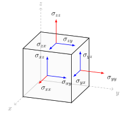{fig-align="center" width="560"}

:::
::::

## Cinématique

::: {.cle}
$$\bm\varepsilon=\nabla^s\bm u=\tfrac12\bigl[\nabla\bm u+(\nabla\bm u)^\top\bigr]$$

:::

$$
\varepsilon_{xx}=\frac{\partial u_x}{\partial x},\qquad
\varepsilon_{xy}=\frac12\Bigl(\frac{\partial u_x}{\partial y}+\frac{\partial u_y}{\partial x}\Bigr),\qquad
\varepsilon_{xz}=\frac12\Bigl(\frac{\partial u_x}{\partial z}+\frac{\partial u_z}{\partial x}\Bigr),\ \dots
$$

::: {.remarque}
Un champ $\bm\varepsilon$ dérive d'un déplacement si et seulement si $\curl\curl\bm\varepsilon=\bm 0$ (compatibilité).
Contre-exemples : défauts, dislocations, déformations résiduelles.

:::

## Loi de Hooke

:::: {.columns}
::: {.column width="50%"}
$$\bm\sigma=\bm{\mathcal D}\,\bm\varepsilon\qquad(\text{ordre }4)$$

Symétries de $\mathcal D_{ijkl}$ :

- [mineures]{.hl} $\mathcal D_{ijkl}=\mathcal D_{jikl}=\mathcal D_{ijlk}$ : $81\to36$ coefficients
- [majeure]{.hl} $\mathcal D_{ijkl}=\mathcal D_{klij}$ (énergie élastique $\Rightarrow$ Schwarz)

:::
::: {.column width="50%"}
**Matériau isotrope**

::: {.cle}
$$\bm\sigma=2\mu\,\bm\varepsilon+\lambda\tr(\bm\varepsilon)\,\bm I$$

:::

$$
\lambda=\frac{E\nu}{(1+\nu)(1-2\nu)},\qquad
\mu=\frac{E}{2(1+\nu)}
$$

$E$ : module d'Young, $\nu$ : coefficient de Poisson

:::
::::

## Réduction 2D

:::: {.columns}
::: {.column width="50%"}
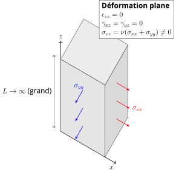{fig-align="center" height="400"}

::: {style="text-align:center"}
[Structure très longue]{.hlp} $\varepsilon_{zz}=0$, $\sigma_{zz}\neq0$

:::
:::
::: {.column width="50%"}
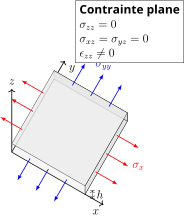{fig-align="center" height="400"}

::: {style="text-align:center"}
[Structure très mince]{.hl} $\sigma_{zz}=0$, $\varepsilon_{zz}\neq0$

:::
:::
::::

## Contrainte plane

$\sigma_{zz}=0 \;\Rightarrow\; \displaystyle\varepsilon_{zz}=-\frac{\nu}{1-\nu}\,(\varepsilon_{xx}+\varepsilon_{yy})$, puis on élimine $\varepsilon_{zz}$ :

::: {.cle}
$$
\bm\sigma_{2D}=\bm{\mathcal D}_{\mathrm{ps}}(\bm\varepsilon_{2D})
=\frac{E}{1-\nu^2}\Bigl[(1-\nu)\,\bm\varepsilon_{2D}+\nu\tr(\bm\varepsilon_{2D})\,\bm I\Bigr]
$$

:::

Notation de Voigt, $\gamma_{xy}=2\varepsilon_{xy}$ :
$$
\begin{pmatrix}\sigma_{xx}\\\sigma_{yy}\\\sigma_{xy}\end{pmatrix}
=\frac{E}{1-\nu^2}
\begin{bmatrix}1&\nu&0\\ \nu&1&0\\ 0&0&\frac{1-\nu}{2}\end{bmatrix}
\begin{pmatrix}\varepsilon_{xx}\\\varepsilon_{yy}\\\gamma_{xy}\end{pmatrix}
$$

::: {style="text-align:center"}
[Loi utilisée par la théorie des plaques]{.hl}

:::

## Problème aux limites

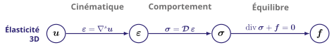{fig-align="center" width="1080"}

:::: {.columns}
::: {.column width="55%"}
$$
\begin{alignedat}{2}
\div\bm\sigma+\bm f&=\bm 0 &\quad&\text{dans }\Omega\\
\bm\sigma&=\bm{\mathcal D}\,\nabla^s\bm u &&\text{dans }\Omega\\
\bm\sigma\,\bm n&=\overline{\bm t} &&\text{sur }\Gamma_t\\
\bm u&=\bm 0 &&\text{sur }\Gamma_u
\end{alignedat}
$$

:::
::: {.column width="45%"}
En déplacement (Navier) :
$$(\lambda+\mu)\nabla\div\bm u+\mu\Delta\bm u+\bm f=\bm 0$$

:::
::::

## Première variation

:::: {.columns}
::: {.column width="52%"}
- Énergie = [fonctionnelle]{.hl} $J:V\to\bbR$
- $\delta u$ : perturbation [admissible]{.hlp}, $\delta u=0$ là où $u$ est imposé

::: {.cle}
$$
\delta J(u)[\delta u]=\left.\frac{d}{d\epsilon}J(u+\epsilon\,\delta u)\right|_{\epsilon=0}
$$

:::

- Mêmes règles qu'une dérivée : $\delta(u^2)=2u\,\delta u$, $\delta(u')=(\delta u)'$

:::
::: {.column width="48%"}
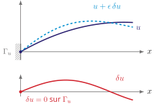{fig-align="center" width="560"}

:::
::::

## Travaux virtuels

$$
\Pi(\bm u)=U-W,\qquad
U=\int_\Omega\tfrac12\,\bm\varepsilon:\bm{\mathcal D}\bm\varepsilon\;d\Omega,\qquad
W=\int_\Omega\bm f\cdot\bm u\,d\Omega+\int_{\Gamma_t}\overline{\bm t}\cdot\bm u\,d\Gamma
$$

::: {.bloc}
**Principe des travaux virtuels**

À l'équilibre, pour tout $\delta\bm u$ cinématiquement admissible ($\delta\bm u=\bm 0$ sur $\Gamma_u$) :
$$
\delta\Pi(\bm u)[\delta\bm u]
=\int_\Omega\bm\sigma:\nabla^s\delta\bm u\,d\Omega
-\int_\Omega\bm f\cdot\delta\bm u\,d\Omega
-\int_{\Gamma_t}\overline{\bm t}\cdot\delta\bm u\,d\Gamma=0
$$

:::

- $\delta U=\int_\Omega\bm\sigma:\delta\bm\varepsilon\,d\Omega$ grâce à la [symétrie majeure]{.hl} de $\bm{\mathcal D}$

## Équations locales

Intégration par parties :
$$
\delta\Pi=-\int_\Omega(\div\bm\sigma+\bm f)\cdot\delta\bm u\,d\Omega
          +\int_{\Gamma_t}(\bm\sigma\bm n-\overline{\bm t})\cdot\delta\bm u\,d\Gamma=0
$$

::: {.bloc}
**Lemme fondamental du calcul des variations**

$\displaystyle\int_\Omega f\,v\,d\Omega=0\quad \forall v\in C_c^\infty(\Omega)\ \Longrightarrow\ f=0$ presque partout

:::

:::: {.columns}
::: {.column width="50%"}
[Conditions essentielles]{.hlp} 
$\bm u=\bm 0$ sur $\Gamma_u$ : imposées à l'espace $V$

:::
::: {.column width="50%"}
[Conditions naturelles]{.hl} 
$\bm\sigma\bm n=\overline{\bm t}$ sur $\Gamma_t$ : obtenues par la variation

:::
::::

# Théorie classique des plaques

## Définition d'une plaque

:::: {.columns}
::: {.column width="40%"}
- Solide plan [mince]{.hl} : $\Omega\times[-h/2,\,h/2]$
- $\Omega\subset\bbR^2$ : surface moyenne
- Épaisseur $h\ll L$ (plaque mince : $h/L\lesssim1/10$)

[Objectif]{.hlp} : ramener un problème 3D à un problème 2D sur $\Omega$

:::
::: {.column width="60%"}
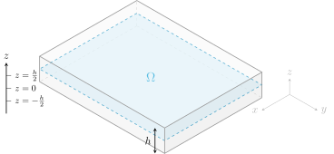{fig-align="center" width="740"}

:::
::::

## Hypothèses de Kirchhoff

Les fibres initialement normales à la surface moyenne…

1. restent [rectilignes]{.hl} ;
2. gardent leur [longueur]{.hl} : $\varepsilon_{zz}=0$ ;
3. restent [normales]{.hl} à la surface déformée : $\gamma_{xz}=\gamma_{yz}=0$.

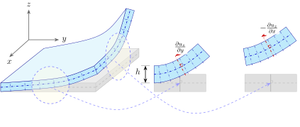{fig-align="center" width="980"}

## Cinématique de la plaque

Cinématique linéaire a priori [@reddy2006theory] : $\bm u(x,y,z)=\bm u^0(x,y)+z\,\bm\theta(x,y)$

- Hyp. 2 : $\varepsilon_{zz}=0 \;\Rightarrow\; u_z=u_z^0=:w$, $\theta_z=0$
- Hyp. 3 : $\gamma_{xz}=\theta_x+\partial_x w=0$, $\gamma_{yz}=\theta_y+\partial_y w=0 \;\Rightarrow\; \bm\theta=-\nabla w$

::: {.cle}
$$
\bm u_m(x,y,z)=\bm u_m^0(x,y)-z\,\nabla w(x,y),\qquad u_z(x,y,z)=w(x,y)
$$

:::

- 3 inconnues 2D : $\bm u_m^0=(u_x^0,u_y^0)$ (membrane) et $w$ (flèche)

## Membrane et courbure

Seules les déformations dans le plan subsistent :
$$
\bm\varepsilon_{2D}=\nabla^s\bm u_m=\nabla^s\bm u_m^0-z\,\nabla^s\nabla w,
\qquad \nabla^s\nabla w=\Hess w
$$

::: {.cle}
$$
\bm\varepsilon_{2D}=\bm\varepsilon^0+z\,\bm\kappa,\qquad
\bm\varepsilon^0=\nabla^s\bm u_m^0,\qquad
\bm\kappa=-\Hess w
$$

:::

$\bm\varepsilon^0$ : déformation de [membrane]{.hl}, $\bm\kappa$ : [courbure]{.hl}
$$
\bm\kappa=-\begin{pmatrix}\partial_{xx}w&\partial_{xy}w\\ \partial_{xy}w&\partial_{yy}w\end{pmatrix}
$$

- Déformation [linéaire en $z$]{.hl} dans l'épaisseur

## Dans l'épaisseur

Loi en [contrainte plane]{.hl} (la déformation plane serait trop rigide) :
$$
\bm\sigma_{2D}=\underbrace{\bm{\mathcal D}_{\mathrm{ps}}(\bm\varepsilon^0)}_{\bm\sigma_m}
  +\underbrace{z\,\bm{\mathcal D}_{\mathrm{ps}}(\bm\kappa)}_{\bm\sigma_b}
$$

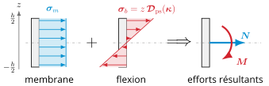{fig-align="center" width="860"}

$$
\bm N=\int_{-h/2}^{h/2}\bm\sigma_{2D}\,dz,\qquad
\bm M=\int_{-h/2}^{h/2}\bm\sigma_{2D}\,z\,dz
$$

## Efforts généralisés

:::: {.columns}
::: {.column width="50%"}
::: {style="text-align:center"}
[Membrane]{.hl}

:::
$$\bm N=h\,\bm\sigma_m=\bm{\mathcal D}_m\,\bm\varepsilon^0$$
$$
\begin{aligned}
N_{xx}&=A(\varepsilon^0_{xx}+\nu\varepsilon^0_{yy})\\
N_{yy}&=A(\varepsilon^0_{yy}+\nu\varepsilon^0_{xx})\\
N_{xy}&=A(1-\nu)\,\varepsilon^0_{xy}
\end{aligned}
$$

::: {.cle}
$$A=\frac{Eh}{1-\nu^2}$$

:::
:::
::: {.column width="50%"}
::: {style="text-align:center"}
[Flexion]{.hlp}

:::
$$\bm M=\tfrac{h^3}{12}\,\bm{\mathcal D}_{\mathrm{ps}}(\bm\kappa)=\bm{\mathcal D}_b\,\bm\kappa$$
$$
\begin{aligned}
M_{xx}&=D(\kappa_{xx}+\nu\kappa_{yy})\\
M_{yy}&=D(\kappa_{yy}+\nu\kappa_{xx})\\
M_{xy}&=D(1-\nu)\,\kappa_{xy}
\end{aligned}
$$

::: {.cle}
$$D=\frac{Eh^3}{12(1-\nu^2)}$$

:::
:::
::::

::: {style="text-align:center"}
Isotrope : membrane et flexion [découplées]{.hl}

:::

## Effort tranchant

$$
\bm Q=\begin{pmatrix}Q_x\\Q_y\end{pmatrix}
=\int_{-h/2}^{h/2}\begin{pmatrix}\sigma_{zx}\\\sigma_{zy}\end{pmatrix}dz
$$

::: {.bloc .alerte}
**Paradoxe (comme pour Euler–Bernoulli)**

- La cinématique impose $\gamma_{xz}=\gamma_{yz}=0$…
- … mais l'équilibre exige $\sigma_{xz},\sigma_{yz}\neq0$

$\bm Q$ n'est [pas]{.hl} donné par une loi de comportement : il est déterminé par l'[équilibre]{.hlp}.

:::

## Équilibre dans le plan

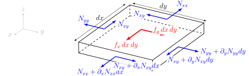{fig-align="center" width="1000"}

:::: {.columns}
::: {.column width="55%"}
$$
\begin{aligned}
\partial_x N_{xx}+\partial_y N_{xy}+f_x&=0\\
\partial_x N_{xy}+\partial_y N_{yy}+f_y&=0
\end{aligned}
$$

:::
::: {.column width="40%"}
::: {.cle}
$$\div\bm N+\bm f_m=\bm 0$$

:::
:::
::::

## Équilibre selon $z$

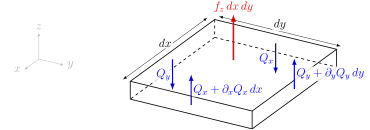{fig-align="center" width="900"}

:::: {.columns}
::: {.column width="55%"}
$$\partial_x Q_x+\partial_y Q_y+f_z=0$$

:::
::: {.column width="40%"}
::: {.cle}
$$\div\bm Q+f_z=0$$

:::
:::
::::

## Équilibre en rotation

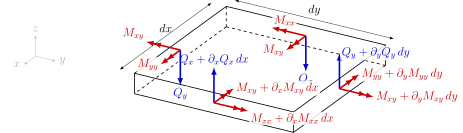{fig-align="center" width="1040"}

:::: {.columns}
::: {.column width="50%"}
$$
\begin{aligned}
Q_x&=\partial_x M_{xx}+\partial_y M_{xy}\\
Q_y&=\partial_x M_{xy}+\partial_y M_{yy}
\end{aligned}
$$

:::
::: {.column width="50%"}
$$\bm Q=\div\bm M$$

::: {.cle}
$$\div\div\bm M+f_z=0$$

:::
:::
::::

## Plaque vs élasticité 3D

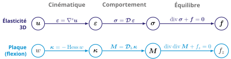{fig-align="center" width="1060"}

:::: {.columns}
::: {.column width="55%"}
[Membrane]{.hl} : $\div(\bm{\mathcal D}_m\nabla^s\bm u_m^0)+\bm f_m=\bm 0$

[Flexion]{.hlp} : $\bm M=-\bm{\mathcal D}_b\Hess w$ dans $\div\div\bm M+f_z=0$

:::
::: {.column width="45%"}
::: {.cle}
$$D\,\Delta^2 w=f_z$$
$$\Delta^2=\partial_{xxxx}+2\,\partial_{xxyy}+\partial_{yyyy}$$

:::
:::
::::

## Domaine de validité

- [Limite asymptotique]{.hlp} de l'élasticité 3D lorsque $h/L\to0$
- Erreur sur la flèche en $\mathcal O(h^2/L^2)$ $\Rightarrow$ fiable pour les [plaques minces]{.hl} ($h/L\lesssim1/10$ à $1/20$)
- Moins précise pour :
  - plaques épaisses
  - stratifiés composites fortement anisotropes

::: {.remarque}
Extension naturelle : [Reissner–Mindlin]{.hlp}, qui autorise le cisaillement transverse ($\bm\theta\neq-\nabla w$).

:::

## Conditions aux limites

:::: {.columns}
::: {.column width="60%"}
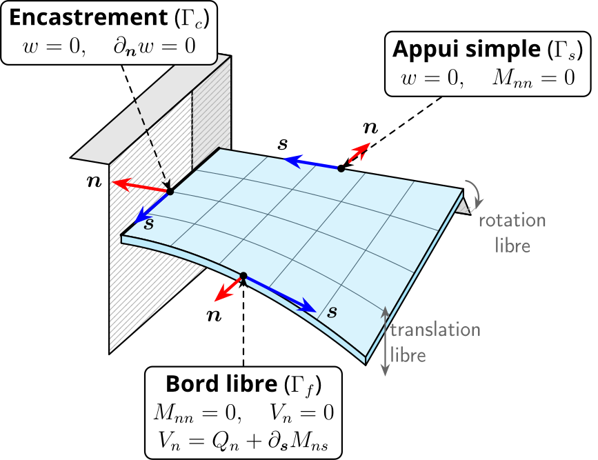{fig-align="center" height="500"}

:::
::: {.column width="40%"}
$\partial\Omega=\Gamma_c\cup\Gamma_s\cup\Gamma_f$

[Moment de flexion]{.hlp} $M_{nn}=\bm n^\top\bm M\,\bm n$

[Moment de torsion]{.hlp} $M_{ns}=\bm n^\top\bm M\,\bm s$

[Effort tranchant effectif]{.hlp} (Kirchhoff)

::: {.cle}
$$V_n=Q_n+\partial_{\bm s}M_{ns}$$

:::
:::
::::

## Bord droit $x=a$

$\bm n=\bm e_x$, $\bm s=\bm e_y$ $\Rightarrow$ $M_{nn}=M_{xx}$, $M_{ns}=M_{xy}$, $V_x=\partial_x M_{xx}+2\,\partial_y M_{xy}$

| **Bord** | **Conditions** | **En fonction de $w$** |
|:--|:--|:--|
| Encastré (C) | $w=0$, $\partial_x w=0$ | $w=0$, $\partial_x w=0$ |
| Appui simple (S) | $w=0$, $M_{xx}=0$ | $w=0$, $\partial_{xx}w=0$ |
| Libre (F) | $M_{xx}=0$, $V_x=0$ | $\partial_{xx}w+\nu\,\partial_{yy}w=0$, $\;\partial_{xxx}w+(2-\nu)\,\partial_{xyy}w=0$ |

::: {.small}
Appui simple : $w=0$ le long du bord $\Rightarrow\partial_{yy}w=0$. Bord $y=\text{cste}$ : permuter $x$ et $y$.

:::

## Énergie de flexion

$$
U=\frac12\int_\Omega\!\int_{-h/2}^{h/2}\bm\sigma_{2D}:\bm\varepsilon_{2D}\,dz\,d\Omega
=\underbrace{\frac12\int_\Omega\bm N:\bm\varepsilon^0\,d\Omega}_{U_m}
+\underbrace{\frac12\int_\Omega\bm M:\bm\kappa\,d\Omega}_{U_b}
$$

Avec $\bm\kappa:\bm\kappa=(\tr\bm\kappa)^2-2\det\bm\kappa$ et $\tr(\Hess w)=\Delta w$ :

::: {.cle}
$$
U_b=\frac D2\int_\Omega\Bigl[(\Delta w)^2-2(1-\nu)\det(\Hess w)\Bigr]\,d\Omega
$$

:::

- $\det(\Hess w)$ : [courbure de Gauss]{.hl} linéarisée
- Point de départ de la [méthode de Ritz]{.hlp} (chapitre 5)

## Travaux virtuels {.smaller}

$$
\Pi_b=U_b-W_b,\qquad
W_b=\int_\Omega f_z\,w\,d\Omega+\int_{\Gamma_f}\overline V_n\,w\,d\Gamma
     -\int_{\Gamma_s\cup\Gamma_f}\overline M_{nn}\,\partial_{\bm n}w\,d\Gamma
$$

Variations admissibles : $\delta w=0$ sur $\Gamma_c\cup\Gamma_s$, $\partial_{\bm n}\delta w=0$ sur $\Gamma_c$

- $\delta U_b=-\int_\Omega\bm M:\Hess\delta w\,d\Omega$ $\to$ [2 intégrations par parties]{.hl}
- $\partial_{\bm s}\delta w$ n'est [pas indépendant]{.hlp} de $\delta w$ $\to$ intégration par parties le long du bord

::: {.cle}
$$
\delta\Pi_b=-\!\int_\Omega(\div\div\bm M+f_z)\,\delta w
+\!\int_{\Gamma_f}(V_n-\overline V_n)\,\delta w
-\!\int_{\Gamma_s\cup\Gamma_f}(M_{nn}-\overline M_{nn})\,\partial_{\bm n}\delta w
$$

:::

## Essentielles / naturelles

$\delta\Pi_b=0$ pour toute variation admissible (lemme fondamental) :
$$
\div\div\bm M+f_z=0\ \text{ dans }\Omega,\qquad
M_{nn}=\overline M_{nn}\ \text{ sur }\Gamma_s\cup\Gamma_f,\qquad
V_n=\overline V_n\ \text{ sur }\Gamma_f
$$

| **Essentielle** (cinématique) | | **Naturelle** (statique) |
|:-:|:-:|:-:|
| $w$ | $\longleftrightarrow$ | $V_n=Q_n+\partial_{\bm s}M_{ns}$ |
| $\partial_{\bm n}w$ | $\longleftrightarrow$ | $M_{nn}$ |

- Sur chaque bord : [une]{.hl} condition de chaque paire
- $V_n$ : conséquence naturelle de la réduction cinématique

# Applications

## Flexion cylindrique

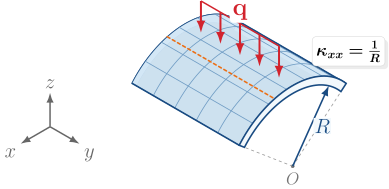{fig-align="center" width="860"}

- Plaque $a\times b$ avec $b\gg a$, chargement invariant selon $y$
- $w=w(x)$ $\Rightarrow$ $\kappa_{yy}=\kappa_{xy}=0$, $\kappa_{xx}=-w''$

## Analogie avec la poutre

:::: {.columns}
::: {.column width="50%"}
::: {.cle}
$$D\,\frac{d^4w}{dx^4}=f_z(x)$$

:::

- Même forme que Euler–Bernoulli
- $M_{yy}\neq0$ : [effet Poisson]{.hl}

:::
::: {.column width="50%"}
| | **Plaque** | **Poutre** |
|:--|:-:|:-:|
| Rigidité | $D$ | $EI$ |
| Moment $M_{xx}$ | $-D\,w''$ | $-EI\,w''$ |
| $M_{yy}$ | $-\nu D\,w''$ | — |
| Contraintes | 2D | 1D |

:::
::::

::: {.remarque}
Par unité de largeur $EI=Eh^3/12$, donc $D/EI=1/(1-\nu^2)\approx1{,}1$ : la plaque est [≈ 10 % plus raide]{.hl}.

:::

## Coordonnées polaires

:::: {.columns}
::: {.column width="52%"}
Opérateurs [intrinsèques]{.hl} : il suffit de changer leur expression
$$
\nabla w=\partial_r w\,\bm e_r+\tfrac1r\partial_\theta w\,\bm e_\theta
$$
$$
\div\bm Q=\tfrac1r\partial_r(rQ_r)+\tfrac1r\partial_\theta Q_\theta
$$
$$
\Delta w=\partial_{rr}w+\tfrac1r\partial_r w+\tfrac1{r^2}\partial_{\theta\theta}w
$$

:::
::: {.column width="48%"}
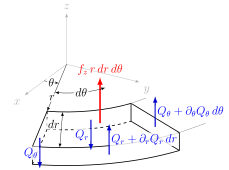{fig-align="center" width="560"}

:::
::::

## Axisymétrie : équilibre

:::: {.columns}
::: {.column width="50%"}
$\partial_\theta=0$ $\Rightarrow$ $Q_\theta=0$, $M_{r\theta}=0$

::: {.cle}
$$\frac1r\frac{d}{dr}(rQ_r)+f_z=0$$

:::

Si $f_z$ constante : $rQ_r=-\dfrac{r^2}{2}f_z$

$\times2\pi$ : bilan global des forces sur un disque de rayon $r$

:::
::: {.column width="50%"}
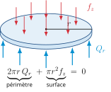{fig-align="center" width="520"}

:::
::::

## Axisymétrie : moments

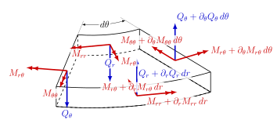{fig-align="center" width="760"}

:::: {.columns}
::: {.column width="50%"}
::: {.cle}
$$Q_r=\frac{M_{rr}-M_{\theta\theta}}{r}+\frac{dM_{rr}}{dr}$$

:::
:::
::: {.column width="45%"}
Le moment circonférentiel $M_{\theta\theta}$ [n'est pas négligeable]{.hl}

:::
::::

## Axisymétrie : flèche {.smaller}

:::: {.columns}
::: {.column width="48%"}
[Courbures]{.hlp}
$$
\kappa_{rr}=-\frac{d^2w}{dr^2},\qquad
\kappa_{\theta\theta}=-\frac1r\frac{dw}{dr}
$$
[Loi de comportement]{.hlp}
$$
\begin{aligned}
M_{rr}&=D(\kappa_{rr}+\nu\kappa_{\theta\theta})\\
M_{\theta\theta}&=D(\kappa_{\theta\theta}+\nu\kappa_{rr})
\end{aligned}
$$

:::
::: {.column width="52%"}
[Effort tranchant]{.hlp}
$$
Q_r=-D\,\frac{d}{dr}(\Delta w),\quad
\Delta=\frac1r\frac{d}{dr}\Bigl(r\frac{d}{dr}\Bigr)
$$
[Équation de la flèche]{.hlp}

::: {.cle}
$$
\frac Dr\frac{d}{dr}\Bigl\{r\frac{d}{dr}\Bigl[\frac1r\frac{d}{dr}\Bigl(r\frac{dw}{dr}\Bigr)\Bigr]\Bigr\}=f_z
$$

:::
:::
::::

$$
U_b=\pi D\!\int_0^a\!\Bigl[\bigl(w''+\tfrac1r w'\bigr)^2-2(1-\nu)\tfrac1r\,w'w''\Bigr]r\,dr
$$

## À retenir {.smaller}

:::: {.columns}
::: {.column width="48%"}
[Cinématique de Kirchhoff–Love]{.hlp}
$$\bm u_m=\bm u_m^0-z\nabla w,\qquad u_z=w$$
$$\bm\varepsilon_{2D}=\bm\varepsilon^0+z\bm\kappa,\quad\bm\kappa=-\Hess w$$
[Efforts généralisés]{.hlp}
$$\bm N=\bm{\mathcal D}_m\bm\varepsilon^0,\qquad \bm M=\bm{\mathcal D}_b\bm\kappa,\qquad D=\frac{Eh^3}{12(1-\nu^2)}$$

:::
::: {.column width="52%"}
[Équilibre]{.hlp}
$$\div\bm N+\bm f_m=\bm 0,\qquad \div\div\bm M+f_z=0$$

::: {.cle}
$$D\,\Delta^2w=f_z$$

:::

[Bords]{.hlp} : $(w,\,V_n)$ et $(\partial_{\bm n}w,\,M_{nn})$

[Énergie]{.hlp}
$$U_b=\tfrac D2\!\int_\Omega\!\bigl[(\Delta w)^2-2(1-\nu)\det\Hess w\bigr]\,d\Omega$$

:::
::::

## {background-color="#0e3b3f"}

::: {style="color:#e8f1f0; text-align:center; margin-top:2.2em; font-size:1.6em; font-weight:700"}
☕ Pause

:::

::: {style="color:#a9c9c6; text-align:center"}
Deuxième heure : flambement et méthode de Ritz

:::

# Flambement et stabilité des plaques

## Le flambement

:::: {.columns}
::: {.column width="18%"}
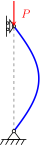{fig-align="center" height="330"}

:::
::: {.column width="82%"}
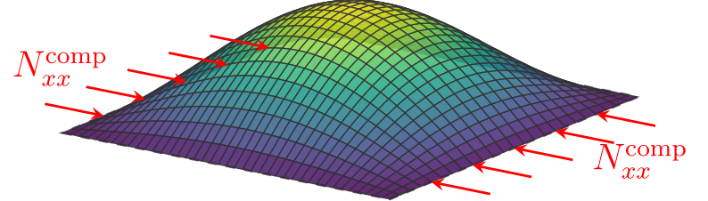{fig-align="center" width="900"}

:::
::::

- Efforts [dans le plan]{.hl} de compression $\bm N$
- Au-delà d'une charge critique, l'état plan $w=0$ devient [instable]{.hlp}
- Bifurcation vers une forme fléchie à charge constante

## Cinématique non linéaire

:::: {.columns}
::: {.column width="64%"}
- La théorie linéaire [découple]{.hl} $\bm N$ et $w$ : pas de flambement possible
- Il faut une mesure de déformation [objective]{.hlp} (nulle pour tout mouvement rigide)

::: {.cle}
$$\bm E=\tfrac12\bigl(\nabla\bm u+\nabla\bm u^\top+\nabla\bm u^\top\nabla\bm u\bigr)$$

:::

::: {style="text-align:center"}
Tenseur de Green–Lagrange

:::
:::
::: {.column width="36%"}
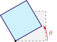{fig-align="center" width="260"}

Rotation rigide d'angle $\theta$ : 
$\bm\varepsilon=(\cos\theta-1)\,\bm I\neq\bm 0$ 
$\bm E=\bm 0$

:::
::::

## Green–Lagrange

$$
\bm u=\begin{pmatrix}\bm u_m^0-z\nabla w\\ w\end{pmatrix}
\quad\Rightarrow\quad
\nabla\bm u=\begin{pmatrix}\nabla\bm u_m^0+z\bm\kappa & -\nabla w\\ \nabla w^\top & 0\end{pmatrix}
$$

Composantes dans le plan :
$$
\bm E_{2D}=\bm\varepsilon_{2D}
+\underbrace{\tfrac12\bigl(\nabla\bm u_m^0+z\bm\kappa\bigr)^\top\bigl(\nabla\bm u_m^0+z\bm\kappa\bigr)}_{\text{déplacements dans le plan}}
+\underbrace{\tfrac12\,\nabla w\otimes\nabla w}_{\text{couplage flexion / membrane}}
$$
$$
\nabla w\otimes\nabla w=\begin{pmatrix}(\partial_x w)^2&\partial_x w\,\partial_y w\\ \partial_x w\,\partial_y w&(\partial_y w)^2\end{pmatrix}
$$

::: {style="text-align:center"}
[Quel terme non linéaire garder ?]{.hl}

:::

## Ordres de grandeur

Minceur $\eta=h/L\ll1$, flèche [modérée]{.hl} $w\sim h$, $\nabla\sim1/L$

| **Quantité** | **Ordre** | |
|:--|:-:|:--|
| $\nabla w$ | $\eta$ | rotations modérées |
| $\tfrac12\nabla w\otimes\nabla w$, $z\bm\kappa$ | $\eta^2$ | |
| $U_b\sim L^2h\,(\eta^2)^2$ | $L^3\eta^5$ | énergie de flexion |
| $U_m\sim L^2h\,\xi^2$ (si $\bm\varepsilon^0\sim\xi$) | $L^3\eta\,\xi^2$ | énergie de membrane |
| $U_m\sim U_b$ $\Rightarrow$ $\xi\sim\eta^2$ $\Rightarrow$ $\nabla\bm u_m^0$ | $\eta^2$ | |
| $\tfrac12(\nabla\bm u_m^0+z\bm\kappa)^\top(\nabla\bm u_m^0+z\bm\kappa)$ | $\eta^4$ | [négligeable]{.hl} |

## Modèle de von Kármán

::: {.cle}
$$
\bm E_{2D}=\nabla^s\bm u_m^0+z\bm\kappa+\tfrac12\,\nabla w\otimes\nabla w
$$

:::

$$
\varepsilon^0_{xx}=\partial_x u_x^0+\tfrac12(\partial_x w)^2,\qquad
\varepsilon^0_{yy}=\partial_y u_y^0+\tfrac12(\partial_y w)^2
$$
$$
\gamma^0_{xy}=\partial_y u_x^0+\partial_x u_y^0+\partial_x w\,\partial_y w
$$

La courbure $\bm\kappa=-\Hess w$ reste [linéaire]{.hl}

::: {.remarque}
[@ciarletta2022fvk; @audoly2010elasticity; @amabili2018nonlinear]

:::

## Équations de von Kármán

$$
\delta U=\int_\Omega\bigl(\bm N:\delta\bm\varepsilon^0+\bm M:\delta\bm\kappa\bigr)\,d\Omega,
\qquad \delta\bm\kappa=-\Hess\delta w
$$
$$
\bm N:\delta\bm\varepsilon^0=\bm N:\nabla\delta\bm u_m^0+(\bm N\nabla w)\cdot\nabla\delta w
\qquad(\bm N\text{ symétrique})
$$

Intégrations par parties, $\delta\bm u_m^0$ et $\delta w$ indépendantes :

::: {.cle}
$$
\begin{aligned}
\div\bm N&=\bm 0 &\qquad&\text{équilibre dans le plan}\\
\div\div\bm M+\div(\bm N\nabla w)+f_z&=0 &&\text{équilibre transverse}
\end{aligned}
$$

:::

::: {style="text-align:center"}
soit $-D\,\Delta^2w+\div(\bm N\nabla w)+f_z=0$

:::

## Terme de couplage

:::: {.columns}
::: {.column width="55%"}
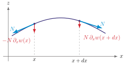{fig-align="center" width="620"}

:::
::: {.column width="45%"}
- Projection de $\bm N$ sur $z$ via la [pente]{.hl} $\nabla w$
- Bilan sur $dx$ : $\partial_x(N\,\partial_x w)\,dx$

::: {.remarque}
$\bm N$ en [traction]{.hlp} : raidissement 
$\bm N$ en [compression]{.hl} : peut vaincre la rigidité de flexion $\to$ [flambement]{.hl}

:::
:::
::::

## Flambement linéarisé

:::: {.columns}
::: {.column width="42%"}
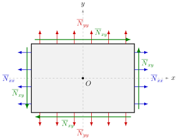{fig-align="center" width="460"}

:::
::: {.column width="58%"}
Précontrainte membranaire [constante]{.hl} $\overline{\bm N}$ :
$$\div(\overline{\bm N}\nabla w)=\overline{\bm N}:\Hess w$$
$f_z=0$, $\overline{\bm N}=\lambda\,\bm N_{\rm ref}$ :

::: {.cle}
$$D\,\Delta^2 w=\lambda\,\bm N_{\rm ref}:\Hess w$$

:::

- $w\neq0$ seulement pour $\lambda=\lambda_k$
- [Charge critique]{.hlp} : $\lambda_{\rm cr}=\min_k\lambda_k$

:::
::::

## Bifurcation et modes

:::: {.columns}
::: {.column width="42%"}
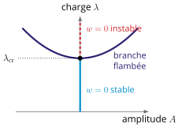{fig-align="center" width="460"}

::: {style="text-align:center"}
Plaques : branche post-critique [stable]{.hl}

:::
:::
::: {.column width="58%"}
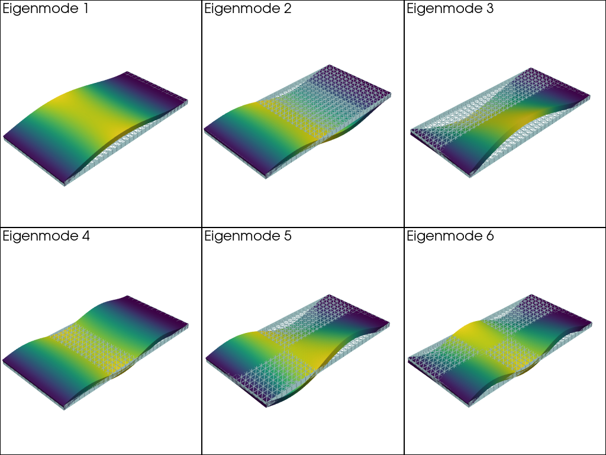{fig-align="center" width="560"}

::: {.small style="text-align:center"}
Six premiers modes (éléments finis) — J. Bleyer, *COMET*

:::
:::
::::

## Exemple : plaque SSSS

$\overline{\bm N}=-N\,\bm e_x\otimes\bm e_x$ ($N>0$), plaque $a\times b$, $\alpha=a/b$ : $\;D\Delta^2 w=-N\,\partial_{xx}w$

Modes exacts : $w_{mn}=\sin\dfrac{m\pi x}{a}\,\sin\dfrac{n\pi y}{b}$ $\Rightarrow$

::: {.cle}
$$N_{mn}=k\,\frac{\pi^2D}{b^2},\qquad k=\Bigl(\frac m\alpha+\frac{n^2\alpha}m\Bigr)^2$$

:::

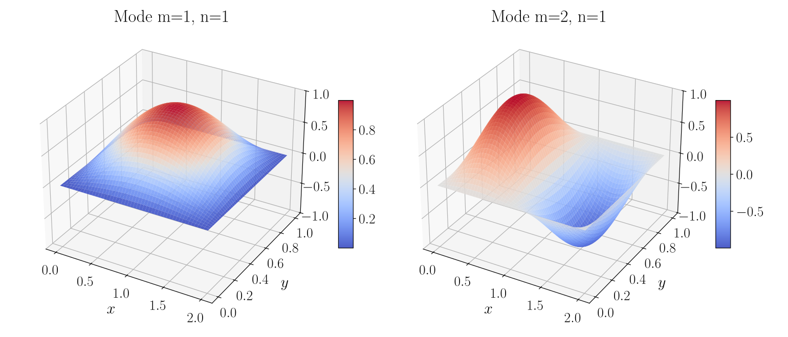{fig-align="center" width="620"}

## Coefficient de flambement

::: {.pw data-widget="buckling" data-alpha="2"}
:::

::: {.small}
$n=1$ : une demi-onde selon $y$ ; $k_{\min}=4$ pour $\alpha$ entier ; $m\to m+1$ demi-ondes en $\alpha=\sqrt{m(m+1)}$. [$\alpha=2$ : mode critique $(2,1)$, $k=4$, et non $(1,1)$, $k=6{,}25$.]{.hl}
:::

## Critère de Trefftz

État plan $w=0$ [stable]{.hl} si l'énergie augmente pour toute perturbation (équivalent continu d'une hessienne [définie positive]{.hlp}) :

::: {.cle}
$$
\delta^2\Pi[0](w)=\left.\frac{d^2}{d\eta^2}\Pi(\eta\,w)\right|_{\eta=0}>0
\qquad\forall\,w\neq0
$$

:::

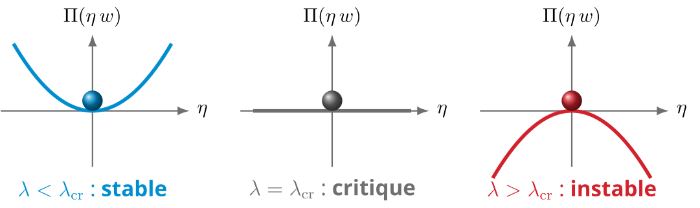{fig-align="center" width="860"}

## Quotient de Rayleigh

[Flexion]{.hlp} (stabilisante) $\qquad U_b(w)=\tfrac D2\!\int_\Omega\!\bigl[(\Delta w)^2-2(1-\nu)\det\Hess w\bigr]\,d\Omega$

[Travail de la précontrainte]{.hl} $\qquad W_m(w)=-\tfrac12\!\int_\Omega\!\bm N_{\rm ref}:(\nabla w\otimes\nabla w)\,d\Omega\;$ ($W_m>0$ en compression)

Énergies quadratiques : $\;\delta^2\Pi[0](w)=2\,U_b(w)-2\lambda\,W_m(w)$, donc stable $\Leftrightarrow$ $U_b(w)>\lambda\,W_m(w)$

::: {.cle}
$$\lambda_{\rm cr}=\min_{w\neq0}\mathcal R(w),\qquad \mathcal R(w)=\frac{U_b(w)}{W_m(w)}$$
:::

::: {style="text-align:center"}
Tout $w$ admissible : [borne supérieure]{.hl} de $\lambda_{\rm cr}$
:::

# Méthode de Ritz

## Formulation énergétique

$$
\Pi(w)=\frac D2\int_\Omega\Bigl[(\Delta w)^2-2(1-\nu)\det\Hess w\Bigr]d\Omega
-\int_\Omega f_z\,w\,d\Omega
$$

- $\delta\Pi=0$ $\Leftrightarrow$ $D\Delta^2 w=f_z$ + conditions aux limites
- Solution exacte : seulement pour quelques géométries et conditions aux limites

:::: {.columns}
::: {.column width="48%"}
::: {.bloc}
**Conditions essentielles**

$w=0$, $\partial_{\bm n}w=0$ : [à imposer]{.hl} aux fonctions d'essai

:::
:::
::: {.column width="48%"}
::: {.bloc .vert}
**Conditions naturelles**

$M_{nn}=0$, $V_n=0$ : vérifiées [au sens faible]{.hl}

:::
:::
::::

## Principe de Ritz

Solution approchée dans un espace de [dimension finie]{.hl} :

::: {.cle}
$$w_N(x,y)=\sum_{i=1}^N c_i\,\varphi_i(x,y),\qquad \varphi_i\in V$$

:::

- $\varphi_i$ : fonctions d'essai (conditions essentielles vérifiées)
- $c_i$ : inconnues

La fonctionnelle devient une [fonction]{.hlp} de $N$ variables :
$$
\Pi(w_N)=\Pi(c_1,\dots,c_N):\bbR^N\to\bbR,
\qquad
\frac{\partial\Pi}{\partial c_i}=0,\quad i=1,\dots,N
$$

## Système linéaire de Ritz

$$
U=\frac12\sum_{i,j}c_i\,K_{ij}\,c_j,\qquad W=\sum_i c_i\,F_i
$$
$$
K_{ij}=D\!\int_\Omega\!\Bigl[\Delta\varphi_i\,\Delta\varphi_j
  -(1-\nu)\bigl(\partial_{xx}\varphi_i\,\partial_{yy}\varphi_j+\partial_{yy}\varphi_i\,\partial_{xx}\varphi_j
  -2\,\partial_{xy}\varphi_i\,\partial_{xy}\varphi_j\bigr)\Bigr]d\Omega
$$
$$
F_i=\int_\Omega f_z\,\varphi_i\,d\Omega
$$

::: {.cle}
$$\mathbf K\,\mathbf c=\mathbf F\qquad\Longrightarrow\qquad w_N=\sum_i c_i\,\varphi_i$$

:::

::: {style="text-align:center"}
$\mathbf K$ : matrice de rigidité de Ritz (symétrique)

:::

## Séparation des variables

Plaque rectangulaire $\Omega=[0,a]\times[0,b]$ : $\;\varphi_{mn}(x,y)=X_m(x)\,Y_n(y)$

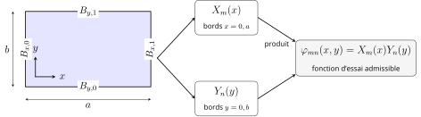{fig-align="center" width="1100"}

- Bords $x=0,a$ $\to$ $X_m$ ; bords $y=0,b$ $\to$ $Y_n$ : [deux problèmes 1D]{.hl}
- Les intégrales d'énergie se [factorisent]{.hl} : calcul à la main possible

## Base 1D admissible

:::: {.columns}
::: {.column width="46%"}
Ordre d'annulation $r$ :

| **Bord** | **Essentielles** | $r$ |
|:--|:--|:-:|
| S | $w=0$ | 1 |
| C | $w=0$, $\partial_{\bm n}w=0$ | 2 |
| F | aucune | 0 |

$\xi=x/a$ ; $B_0$, $B_1$ : bords $0$ et $a$

::: {.cle}
$$g_{B_0B_1}(\xi)=\xi^{\,r(B_0)}(1-\xi)^{\,r(B_1)}$$
$$X_m=g_{B_0B_1}(\xi)\,P_m(\xi)$$

:::
:::
::: {.column width="54%"}
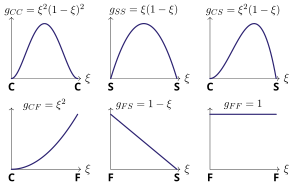{fig-align="center" width="620"}

::: {style="text-align:center"}
Profils $m=0$ ($P_0=1$)

:::
:::
::::

## Règles pratiques

- $P_m=\xi^m$ à la main (Legendre en numérique) ;
- Premier essai : $m=0$, $X_0=g_{B_0B_1}$ (aucun calcul)
- [Bords S]{.hlp} : alternative trigonométrique $X_m=\sin(m\pi x/a)$ vérifie aussi $X_m''=0$ $\to$ convergence plus rapide (Navier)
- [Bords F]{.hlp} : $g_{FF}=1$ ; en FF–FF, $\varphi_{00}=1$ est un [mode rigide]{.hl} ($U=0$, $\mathbf K$ singulière) : à écarter
- [Ne jamais imposer]{.hl} les conditions naturelles

::: {.remarque}
Exemple CC–SS : $\varphi_{mn}=\underbrace{\xi^2(1-\xi)^2\,P_m(\xi)}_{X_m}\ \underbrace{\sin(n\pi y/b)}_{Y_n}$

:::

## Énergie séparée {.smaller}

Un seul terme $w=c\,X(x)Y(y)$, charge uniforme $p_0$ :

::: {.cle}
$$
K=D\Bigl[A_xC_y+C_xA_y+2\nu\,D_xD_y+2(1-\nu)\,B_xB_y\Bigr]
$$
$$
F=p_0\,S_xS_y,\qquad c=\frac FK
$$

:::

Intégrales 1D, avec $X(x)=g(x/a)$ — [aucune intégrale 2D]{.hl} :
$$
\begin{gathered}
A_x=\frac1{a^3}\!\int_0^1\!(g'')^2,\quad
B_x=\frac1a\!\int_0^1\!(g')^2,\quad
C_x=a\!\int_0^1\!g^2,\\
D_x=\frac1a\!\int_0^1\!gg'',\quad
S_x=a\!\int_0^1\!g
\end{gathered}
$$

## Intégrales tabulées

| | $g(\xi)$ | $\int g$ | $\int g^2$ | $\int(g')^2$ | $\int gg''$ | $\int(g'')^2$ |
|:-:|:-:|:-:|:-:|:-:|:-:|:-:|
| CC | $\xi^2(1-\xi)^2$ | $\frac1{30}$ | $\frac1{630}$ | $\frac2{105}$ | $-\frac2{105}$ | $\frac45$ |
| SS | $\xi(1-\xi)$ | $\frac16$ | $\frac1{30}$ | $\frac13$ | $-\frac13$ | $4$ |
| CS | $\xi^2(1-\xi)$ | $\frac1{12}$ | $\frac1{105}$ | $\frac2{15}$ | $-\frac2{15}$ | $4$ |
| CF | $\xi^2$ | $\frac13$ | $\frac15$ | $\frac43$ | $\frac23$ | $4$ |
| FS | $1-\xi$ | $\frac12$ | $\frac13$ | $1$ | $0$ | $0$ |
| FF | $1$ | $1$ | $1$ | $0$ | $0$ | $0$ |
| SS trig. | $\sin\pi\xi$ | $\frac2\pi$ | $\frac12$ | $\frac{\pi^2}2$ | $-\frac{\pi^2}2$ | $\frac{\pi^4}2$ |

[Contrôle]{.hl} : si $w=0$ sur tout le contour, $D_xD_y=B_xB_y$ et $\nu$ [disparaît]{.hl}

## Exemple : flexion SSSS {.smaller}

Plaque carrée $\Omega=[0, a]^2$, pression uniforme $p_0$, un seul terme ($\nu$ s'élimine) :

:::: {.columns}
::: {.column width="50%"}
[Enveloppe polynomiale]{.hlp} — $X=\xi(1-\xi)$, $Y=\eta(1-\eta)$
$$
\frac KD=\frac{22}{45a^2}, \qquad F=\dfrac{p_0a^2}{36}, \qquad c=\dfrac{5\,p_0a^4}{88\,D}
$$

:::
::: {.column width="50%"}
[Base trigonométrique]{.hlp} — $X=\sin(\pi x/a)$, $Y=\sin(\pi y/a)$
$$\frac KD=\frac{\pi^4}{a^2},\qquad F=\frac{4p_0a^2}{\pi^2},\qquad c=\dfrac{4\,p_0a^4}{\pi^6 D}$$

:::
::::

| | $w_{\max}\;[p_0a^4/D]$ | erreur |
|:--|:-:|:-:|
| Polynomiale ($c/16$) | $3{,}55\times10^{-3}$ | $-13\,\%$ |
| Trigonométrique ($c$) | $4{,}16\times10^{-3}$ | $+2{,}4\,\%$ |
| Référence | $4{,}06\times10^{-3}$ | — |

## Calculateur de Ritz

::: {.pw data-widget="ritz1"}
:::

## Démarche pratique

1. Identifier les conditions [essentielles]{.hl} et les ordres $r$
2. Construire les enveloppes $g$ et la base $X_mY_n$ (commencer par $m=n=0$)
3. Calculer les intégrales 1D (tableau si $P_0=1$)
4. Assembler $K$ et $F$, résoudre $c=F/K$ (ou $\mathbf K\mathbf c=\mathbf F$)
5. Enrichir la base et vérifier la [stabilité]{.hl} de la quantité d'intérêt

::: {.bloc .alerte}
**Attention**

Ritz minimise l'énergie : la [souplesse globale]{.hlp} $\int_\Omega f_z\,w\,d\Omega$ est sous-estimée.
Une valeur ponctuelle ($w_{\max}$) n'est [pas]{.hl} encadrée : cf. $-13\,\%$ et $+2{,}4\,\%$.

:::

## Rayleigh–Ritz {.smaller}

- [Rayleigh]{.hlp} : une seule fonction d'essai, $\lambda_{\rm cr}\approx\mathcal R(\varphi_1)$
- [Ritz]{.hlp} : combinaison de $N$ fonctions $\to$ modes supérieurs

$$
U_b=\tfrac12\,\mathbf c^\top\mathbf K\,\mathbf c,\qquad
\tfrac12\!\int_\Omega\!\bm N_{\rm ref}:(\nabla w\otimes\nabla w)=\tfrac12\,\mathbf c^\top\mathbf K_G\,\mathbf c
$$
$$
K_{G,ij}=\int_\Omega\bm N_{\rm ref}:(\nabla\varphi_i\otimes\nabla\varphi_j)\,d\Omega
$$

::: {.cle}
$$
\lambda(\mathbf c)=-\frac{\mathbf c^\top\mathbf K\,\mathbf c}{\mathbf c^\top\mathbf K_G\,\mathbf c}
\quad\Longrightarrow\quad
\mathbf K\,\mathbf c=-\lambda\,\mathbf K_G\,\mathbf c
$$

:::

::: {style="text-align:center"}
Problème aux valeurs propres [généralisé]{.hl}

:::

## Exemple : Rayleigh SSSS

Plaque carrée, $\overline{\bm N}=-N\,\bm e_x\otimes\bm e_x$ $\Rightarrow$ $W_m=\tfrac12\int_\Omega(\partial_x w)^2=\tfrac12\,c^2\,B_xC_y$

:::: {.columns}
::: {.column width="50%"}
[Enveloppe]{.hlp} $\xi(1-\xi)\,\eta(1-\eta)$
$$
N_{\rm cr}\approx\frac{K}{B_xC_y}
=\frac{22/45}{1/90}\,\frac D{a^2}
=44\,\frac D{a^2}
$$

:::
::: {.column width="50%"}
[Sinus]{.hlp} $\sin(\pi x/a)\sin(\pi y/a)$
$$
N_{\rm cr}=\frac{\pi^4}{\pi^2/4}\,\frac D{a^2}=4\pi^2\frac D{a^2}
$$
exact (c'est le mode)

:::
::::

::: {.cle}
$$
44\,\frac D{a^2}\ \geq\ 4\pi^2\frac D{a^2}\approx39{,}5\,\frac D{a^2}
\qquad(+11{,}5\,\%)
$$

:::

::: {style="text-align:center"}
[Mêmes intégrales]{.hl} que pour la flexion

:::

## Convergence

::: {.pw data-widget="rrconv"}
:::

::: {.small}
$\lambda_{\min}^{\text{approchée}}\geq\lambda_{\rm cr}^{\text{exacte}}$ : base restreinte = [rigidité artificielle]{.hl}, convergence monotone. Paliers à 4 et 16 fonctions : les termes impairs n'enrichissent pas le mode [symétrique]{.hl}.
:::

## Ritz et éléments finis

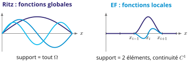{fig-align="center" width="980"}

- Éléments finis = méthode de Ritz à fonctions à [support local]{.hl}
- Même cadre énergétique : minimisation de $\Pi$
- Flexion (dérivées secondes) : fonctions $C^1$ nécessaires
- Perspective : fonctions d'essai données par un réseau de neurones [@lu2025ritz]

## À retenir {.smaller}

:::: {.columns}
::: {.column width="50%"}
[von Kármán]{.hlp}
$$\bm\varepsilon^0=\nabla^s\bm u_m^0+\tfrac12\nabla w\otimes\nabla w$$
$$-D\Delta^2w+\div(\bm N\nabla w)+f_z=0$$
[Flambement linéarisé]{.hlp}
$$D\Delta^2w=\lambda\,\bm N_{\rm ref}:\Hess w$$

::: {.cle}
$$\lambda_{\rm cr}=\min_{w\neq0}\frac{U_b(w)}{W_m(w)}$$

:::
:::
::: {.column width="50%"}
[Ritz]{.hlp}
$$w_N=\sum c_i\varphi_i,\qquad\varphi_i\in V$$
$$\mathbf K\mathbf c=\mathbf F,\qquad \mathbf K\mathbf c=-\lambda\,\mathbf K_G\mathbf c$$
[Plaque rectangulaire]{.hlp}
$$\varphi_{mn}=X_mY_n,\quad X_m=g_{B_0B_1}P_m$$
[Garanties]{.hlp} 
Souplesse sous-estimée, $\lambda_{\rm cr}$ surestimée

:::
::::

## Merci de votre attention {background-color="#0e3b3f"}

::: {style="color:#e8f1f0; margin-top:1.2em"}
**À vous de jouer :** [PC 1 · Solutions analytiques](pc1.qmd){style="color:#f0bd5e"} · [PC 2 · Méthodes énergétiques](pc2.qmd){style="color:#f0bd5e"} · [Laboratoire interactif](lab.qmd){style="color:#f0bd5e"}

:::

## Bibliographie {.smaller}

::: {#refs .small}
:::
