## Plan du cours

[$\newcommand{\bm}[1]{\boldsymbol{#1}}\newcommand{\odv}[2]{\frac{\mathrm d #1}{\mathrm d #2}}\newcommand{\odvn}[3]{\frac{\mathrm d^{#1} #2}{\mathrm d #3^{#1}}}\newcommand{\pdv}[2]{\frac{\partial #1}{\partial #2}}\newcommand{\pdvn}[3]{\frac{\partial^{#1} #2}{\partial #3^{#1}}}\newcommand{\d}{\mathrm d}$]{style="display:none"}

```{=html}
<div class="agenda">
  <div class="step"><span>1</span><div><b>Modèle de poutre</b><small>cinématique, efforts, équilibre, conditions aux limites</small></div></div>
  <div class="step"><span>2</span><div><b>Formulation faible</b><small>travaux virtuels, énergie de flexion</small></div></div>
  <div class="step"><span>3</span><div><b>Élément fini de poutre</b><small>interpolation d'Hermite, matrice de raideur élémentaire</small></div></div>
  <div class="step"><span>4</span><div><b>Assemblage et résolution</b><small>matrice et forces globales, conditions aux limites, convergence</small></div></div>
  <div class="step"><span>5</span><div><b>Dynamique</b><small>matrice de masse, modes propres, réduction modale</small></div></div>
</div>
```

::: {.small .muted}
Astuces : <kbd>F</kbd> plein écran · <kbd>O</kbd> vue d'ensemble · <kbd>M</kbd> menu · <kbd>E</kbd> export PDF · <kbd>B</kbd> tableau noir. Les encadrés **Simulation** sont interactifs : manipulez les curseurs.
:::

# Modèle de poutre

## Du milieu continu à la poutre

::: {.bloc .alerte}
**Milieu continu.** La mécanique des milieux continus (MMC) est le fondement de la mécanique des solides, mais sa résolution (analytique ou numérique) est [souvent trop complexe]{.hl}.
:::

::: {.bloc}
**Mécanique des structures.** Des simplifications sur la géométrie et les chargements s'appliquent aux solides dont [au moins une dimension est très petite devant les autres]{.hlp}.
:::

::: {.remarque}
Aujourd'hui : poutres d'**Euler–Bernoulli**, puis leur discrétisation par éléments finis, en statique et en dynamique.
:::

## Problème à analyser

:::: {.columns}
::: {.column width="64%"}
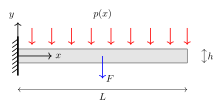{fig-align="center" width="640"}
:::
::: {.column width="34%"}
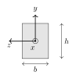{fig-align="center" width="230"}
:::
::::

::: {.remarque}
Pour un matériau quelconque, traction et flexion sont [couplées]{.hl}. Si le matériau est **isotrope**, on peut découpler le comportement en traction (le long de l'axe) du comportement en flexion : on traite ici la flexion.
:::

## Modèle d'Euler–Bernoulli {.smaller}

:::: {.columns}
::: {.column width="46%"}
- Poutre mince : $h,\,b\ll L$
- Solide prismatique : la section ne change pas le long de l'axe
- Les sections droites restent perpendiculaires à l'axe neutre (Kirchhoff) : $\phi_z=\odv{v}{x}$
- $v(x)$ : déplacement de l'axe moyen ; $\phi_z(x)$ : rotation de la section
:::
::: {.column width="54%"}
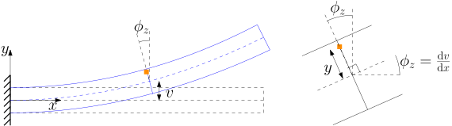{fig-align="center" width="520"}
:::
::::

$$
\bm u=\begin{pmatrix}-y\sin\phi_z\\ v-y(1-\cos\phi_z)\end{pmatrix}
\;\overset{\text{petits angles}}{\approx}\;
\begin{pmatrix}-y\,\phi_z\\ v\end{pmatrix}
\;\overset{\text{Kirchhoff}}{=}\;
\begin{pmatrix}-y\,\odv{v}{x}\\ v\end{pmatrix}
$$


## Simulation : la cinématique de Kirchhoff

::: {.pw data-widget="kinematics"}
:::

::: {.small .muted}
Les sections restent planes **et** perpendiculaires à la tangente. Passez en « petits angles » : l'écart avec la rotation exacte est du second ordre en $\phi$.
:::

## Déformations et contraintes {.smaller}

Tenseur des déformations $\bm\varepsilon=\tfrac12\bigl(\nabla\bm u+(\nabla\bm u)^\top\bigr)$ avec $\bm u=(-y\,v',\ v)^\top$ :

$$
\begin{aligned}
\varepsilon_{xx}&=\pdv{u_x}{x}=-y\,\odvn{2}{v}{x},\\
\varepsilon_{yy}&=\pdv{u_y}{y}=0,\\
\varepsilon_{xy}&=\tfrac12\Bigl(\pdv{u_y}{x}+\pdv{u_x}{y}\Bigr)=\tfrac12\bigl(v'-\phi_z\bigr)\overset{\text{Kirchhoff}}{=}0.
\end{aligned}
$$

::: {.cle}
Loi de Hooke uniaxiale :
$$\sigma_{xx}=E\,\varepsilon_{xx}=-E\,y\,\odvn{2}{v}{x}$$
:::


## Efforts résultants {.smaller}

:::: {.columns}
::: {.column width="34%"}
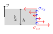{fig-align="center" width="330"}
:::
::: {.column width="66%"}
$$
\begin{aligned}
T(x)&=\int_S\sigma_{xy}\,\d S &&\text{effort tranchant}\\
M(x)&=-\int_S y\,\sigma_{xx}\,\d S &&\text{moment de flexion}
\end{aligned}
$$
:::
::::

- Le signe $-$ dans $M$ : $M$ est **positif** dans le sens antihoraire (selon $z$).
- $T$ n'a pas de déformation associée ($\varepsilon_{xy}=0$) : c'est une réaction de la contrainte cinématique.
- Pour le moment :
$$M=E\,\odvn{2}{v}{x}\int_S y^2\,\d S=EI\,\odvn{2}{v}{x},\qquad I:=\int_S y^2\,\d S=\frac{bh^3}{12}\ \text{(section rectangulaire)}$$

## Équilibre statique {.smaller}

:::: {.columns}
::: {.column width="38%"}
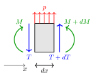{fig-align="center" width="300"}
:::
::: {.column width="62%"}
Équilibre en translation verticale :
$$T+\d T+p\,\d x=T\ \Longrightarrow\ \odv{T}{x}=-p$$

Équilibre en rotation :
$$M+\d M+T\,\d x=M+\frac{p\,(\d x)^2}{2}$$

En négligeant les termes d'ordre deux : $T=-\odv{M}{x}$.
:::
::::

::: {.cle}
$$\odvn{2}{M}{x}=EI\,\odvn{4}{v}{x}=p$$
:::

## Problème et conditions aux limites

Quatre conditions aux limites sont nécessaires pour résoudre $EI\,v''''=p$ :

:::: {.columns}
::: {.column width="50%"}
::: {.bloc}
**Cinématiques (Dirichlet)**
$$
\begin{aligned}
v&=\widehat v &&\text{sur }\Gamma_v\\
v'&=\widehat\phi &&\text{sur }\Gamma_\phi
\end{aligned}
$$
:::
:::
::: {.column width="50%"}
::: {.bloc .vert}
**Dynamiques (Neumann)**
$$
\begin{aligned}
-EI\,v'''&=\widehat T &&\text{sur }\Gamma_T\\
EI\,v''&=\widehat M &&\text{sur }\Gamma_M
\end{aligned}
$$
:::
:::
::::

On ne peut pas imposer simultanément :

- la force et le déplacement : $\Gamma_v\cap\Gamma_T=\emptyset$ ;
- la rotation et le moment : $\Gamma_\phi\cap\Gamma_M=\emptyset$.

## Exemples de conditions aux limites

:::: {.columns}
::: {.column width="50%"}
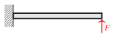{fig-align="center" width="470"}

**Poutre encastrée–libre**
$$
\begin{aligned}
v(0)&=0, & v'(0)&=0,\\
EI\,v''(L)&=0, & -EI\,v'''(L)&=F.
\end{aligned}
$$
:::
::: {.column width="50%"}
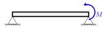{fig-align="center" width="470"}

**Poutre simplement appuyée**
$$
\begin{aligned}
v(0)&=0, & EI\,v''(0)&=0,\\
v(L)&=0, & EI\,v''(L)&=M.
\end{aligned}
$$
:::
::::

# Formulation faible

## Espace d'approximation

Le problème homogène $EI\,v''''=0$ a pour solutions les **polynômes cubiques** :

$$v(x)=a_0+a_1x+a_2x^2+a_3x^3=\begin{bmatrix}1&x&x^2&x^3\end{bmatrix}\begin{pmatrix}a_0\\a_1\\a_2\\a_3\end{pmatrix}$$

::: {.remarque}
Quatre coefficients $\leftrightarrow$ quatre conditions aux limites : on prendra **deux nœuds**, avec pour chacun un déplacement et une rotation.
:::

## Forme faible du problème

On multiplie $EI\,v''''=p$ par une variation arbitraire $\delta v$ et on intègre deux fois par parties :

$$
\int_0^L EI\,\delta v''\,v''\,\d x=-\Bigl[\delta v\,EI\,v'''\Bigr]_0^L+\Bigl[\delta v'\,EI\,v''\Bigr]_0^L+\int_0^L\delta v\,p\,\d x
$$

::: {.bloc}
**Traitement des conditions aux limites**

- Les conditions **dynamiques** (Neumann) sont [naturelles]{.hlp} : elles entrent dans la formulation grâce à l'intégration par parties.
- Les conditions **cinématiques** (Dirichlet) sont [essentielles]{.hl} : elles sont incorporées dans l'espace d'approximation.
:::

## Forme faible et conditions aux limites

Avec $v|_{\Gamma_v}=0$, $v'|_{\Gamma_\phi}=0$, $EI\,v''|_{\Gamma_M}=\widehat M$ et $-EI\,v'''|_{\Gamma_T}=\widehat T$ :

::: {.cle}
Trouver $v$ avec $v|_{\Gamma_v}=0,\ v'|_{\Gamma_\phi}=0$ tel que, pour tout $\delta v$ vérifiant les mêmes conditions,
$$
\underbrace{\int_0^L EI\,\delta v''\,v''\,\d x}_{\text{travail virtuel interne}}=
\underbrace{\delta v\,\widehat T\Big|_{\Gamma_T}+\delta v'\,\widehat M\Big|_{\Gamma_M}+\int_0^L\delta v\,p\,\d x}_{\text{travail virtuel externe}}
$$
:::

## Justification énergétique

Énergie de flexion :
$$E_f=\frac12\int_V\varepsilon_{xx}\sigma_{xx}\,\d V=\frac12\int_V E\,\varepsilon_{xx}^2\,\d V=\frac12\int_0^L EI\,(v'')^2\,\d x$$

Variation de l'énergie :
$$\delta E_f:=\lim_{\eta\to0}\frac{E_f(v+\eta\,\delta v)-E_f(v)}{\eta}=\int_0^L EI\,\delta v''\,v''\,\d x$$

::: {.bloc .vert}
**Mouvements rigides infinitésimaux.** $\delta E_f=0$ si $v=\text{cste}$ ou $v=x$ (translation et rotation) : ils ne coûtent aucune énergie.
:::

## Principe des travaux virtuels

Travail virtuel des forces et moments extérieurs :

$$\delta W_f=\delta v\,\widehat T\Big|_{\Gamma_T}+\delta v'\,\widehat M\Big|_{\Gamma_M}+\int_0^L\delta v\,p\,\d x$$

::: {.cle}
La formulation faible exprime la conservation de l'énergie :
$$\delta E_f=\delta W_f$$
:::

# Élément fini de poutre

## Élément de poutre

:::: {.columns}
::: {.column width="55%"}
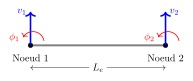{fig-align="center" width="600"}
:::
::: {.column width="45%"}
Degrés de liberté (ddl) :

- déplacements nodaux $v_1,\,v_2$ ;
- rotations nodales $\phi_1,\,\phi_2$.
:::
::::

On cherche le déplacement sous la forme
$$v(x)=\bm N(x)\,\bm q_e,\qquad \bm q_e=\begin{bmatrix}v_1&\phi_1&v_2&\phi_2\end{bmatrix}^\top$$

## Lien coefficients – degrés de liberté

Approximation $v(x)=a_0+a_1x+a_2x^2+a_3x^3$ et conditions nodales :

$$v(0)=v_1,\quad v'(0)=\phi_1,\quad v(L_e)=v_2,\quad v'(L_e)=\phi_2$$

On obtient le système

$$
\begin{bmatrix}
1&0&0&0\\
0&1&0&0\\
1&L_e&L_e^2&L_e^3\\
0&1&2L_e&3L_e^2
\end{bmatrix}
\begin{pmatrix}a_0\\a_1\\a_2\\a_3\end{pmatrix}=
\begin{pmatrix}v_1\\\phi_1\\v_2\\\phi_2\end{pmatrix}
$$

## Fonctions d'interpolation

En inversant ce système, $v(x)=\bm N(x)\,\bm q_e$ avec les **splines cubiques d'Hermite** ($\xi=x/L_e$) :

$$
\begin{aligned}
N_1&=1-3\xi^2+2\xi^3, & N_2&=L_e\,(\xi-2\xi^2+\xi^3),\\
N_3&=3\xi^2-2\xi^3, & N_4&=L_e\,(-\xi^2+\xi^3).
\end{aligned}
$$

::: {.bloc}
**Propriétés.** $N_1(0)=1$, $N_3(L_e)=1$ ; $N_2'(0)=1$, $N_4'(L_e)=1$ ; toutes les autres valeurs et pentes nodales sont nulles. Les fonctions sont $C^1$ aux nœuds : la rotation est continue.
:::

## Simulation : l'interpolation d'Hermite

::: {.pw data-widget="hermite"}
:::

## Matrice de raideur élémentaire

On substitue $v=\bm N\bm q_e$, $\delta v=\bm N\,\delta\bm q_e$ dans la forme faible. Le lien courbure–ddl est

$$v''=\odvn{2}{\bm N}{x}\,\bm q_e=\bm B\,\bm q_e$$

et la variation d'énergie donne

::: {.cle}
$$\delta E_f=\delta\bm q_e^\top\bm K_e\,\bm q_e,\qquad \bm K_e:=\int_0^{L_e}EI\,\bm B^\top\bm B\,\d x$$
:::

## Raideur élémentaire $\bm K_e$

$$
\bm K_e=\frac{EI}{L_e^3}
\begin{bmatrix}
12&6L_e&-12&6L_e\\
6L_e&4L_e^2&-6L_e&2L_e^2\\
-12&-6L_e&12&-6L_e\\
6L_e&2L_e^2&-6L_e&4L_e^2
\end{bmatrix}
$$

Le noyau de $\bm K_e$ est formé des **mouvements rigides** (translation et rotation) :

$$\ker\bm K_e=\operatorname{span}\left\{\begin{pmatrix}1\\0\\1\\0\end{pmatrix},\ \begin{pmatrix}0\\1\\L_e\\1\end{pmatrix}\right\}$$

## Simulation : une colonne de $\bm K_e$

::: {.pw data-widget="elemK"}
:::

## Complément : ajout de la traction

Le déplacement horizontal utilise les fonctions chapeaux ($\xi=x/L_e$) :
$$u=\begin{bmatrix}1-\xi&\xi\end{bmatrix}\begin{pmatrix}u_1\\u_2\end{pmatrix}$$

Avec l'énergie de traction $E_t=\tfrac12\int_0^L EA\,(u')^2\,\d x$, on trouve

$$\delta E_t=\begin{pmatrix}\delta u_1&\delta u_2\end{pmatrix}\begin{bmatrix}\dfrac{EA}{L_e}&-\dfrac{EA}{L_e}\\[2mm]-\dfrac{EA}{L_e}&\dfrac{EA}{L_e}\end{bmatrix}\begin{pmatrix}u_1\\u_2\end{pmatrix}$$

## Matrice de raideur de poutre (traction + flexion)

::: {.smaller}
$$
\bm K_e=\begin{bmatrix}
\color{#c0392b}{\frac{EA}{L_e}}&0&0&\color{#c0392b}{-\frac{EA}{L_e}}&0&0\\
0&\color{#2b7bb9}{\frac{12EI}{L_e^3}}&\color{#2b7bb9}{\frac{6EI}{L_e^2}}&0&\color{#2b7bb9}{-\frac{12EI}{L_e^3}}&\color{#2b7bb9}{\frac{6EI}{L_e^2}}\\
0&\color{#2b7bb9}{\frac{6EI}{L_e^2}}&\color{#2b7bb9}{\frac{4EI}{L_e}}&0&\color{#2b7bb9}{-\frac{6EI}{L_e^2}}&\color{#2b7bb9}{\frac{2EI}{L_e}}\\
\color{#c0392b}{-\frac{EA}{L_e}}&0&0&\color{#c0392b}{\frac{EA}{L_e}}&0&0\\
0&\color{#2b7bb9}{-\frac{12EI}{L_e^3}}&\color{#2b7bb9}{-\frac{6EI}{L_e^2}}&0&\color{#2b7bb9}{\frac{12EI}{L_e^3}}&\color{#2b7bb9}{-\frac{6EI}{L_e^2}}\\
0&\color{#2b7bb9}{\frac{6EI}{L_e^2}}&\color{#2b7bb9}{\frac{2EI}{L_e}}&0&\color{#2b7bb9}{-\frac{6EI}{L_e^2}}&\color{#2b7bb9}{\frac{4EI}{L_e}}
\end{bmatrix}
$$

avec $\bm q_e=\begin{pmatrix}u_1&v_1&\phi_1&u_2&v_2&\phi_2\end{pmatrix}^\top$.
:::

[Traction ([rouge]{.hl}) et flexion ([bleu]{style="color:#2b7bb9;font-weight:650"}) sont découplées : les deux blocs ne partagent aucun ddl.]{.small .muted}

## Chargement distribué élémentaire

:::: {.columns}
::: {.column width="38%"}
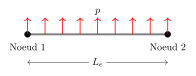{.nostretch fig-align="center" width="380"}
:::
::: {.column width="62%"}
Le vecteur force est donné par le travail virtuel des forces extérieures :
$$\delta W=\int_0^{L_e}\delta v\,p\,\d x=\delta\bm q_e^\top\int_0^{L_e}\bm N^\top p\,\d x=\delta\bm q_e^\top\bm f_e$$
:::
::::

Pour $p$ constant :
$$\bm f_e^{\text{rép.}}=p\int_0^{L_e}\bm N^\top\d x=\frac{p\,L_e}{2}\begin{pmatrix}1\\ L_e/6\\ 1\\ -L_e/6\end{pmatrix}$$

## Forces et moments concentrés aux nœuds {.smaller}

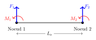{.nostretch fig-align="center" width="560"}

$$
\delta W=\underbrace{\begin{pmatrix}\delta v_1&\delta\phi_1&\delta v_2&\delta\phi_2\end{pmatrix}}_{\delta\bm q_e^\top}\begin{pmatrix}F_1\\M_1\\F_2\\M_2\end{pmatrix},
\qquad
\bm f_e^{\text{nodal}}=\begin{pmatrix}F_1\\M_1\\F_2\\M_2\end{pmatrix}
$$

# Assemblage et résolution

## Plusieurs éléments finis {.smaller}

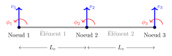{.nostretch fig-align="center" width="620"}

Les éléments ont les mêmes propriétés ($E,\,I,\,S$) et la même longueur $L_e$ : on a donc la même matrice élémentaire.

Trois nœuds, deux ddl chacun :
$$\bm q=\begin{pmatrix}v_1&\phi_1&v_2&\phi_2&v_3&\phi_3\end{pmatrix}^\top$$

::: {.fragment}
$\bm q_{e1}=(v_1,\phi_1,v_2,\phi_2)$  et  $\bm q_{e2}=(v_2,\phi_2,v_3,\phi_3)$ : le nœud 2 est **partagé**.
:::

## Simulation : assemblage de $\bm K$ et de $\bm f$

::: {.pw data-widget="assembly"}
:::


## Assemblage de la force distribuée

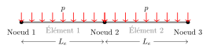{.nostretch fig-align="center" width="640"}

$$\bm f_e=-\frac{p\,L_e}{2}\begin{pmatrix}1&\frac{L_e}{6}&1&-\frac{L_e}{6}\end{pmatrix}^\top\quad\Longrightarrow\quad
\bm f=\bm f_{e1}+\bm f_{e2}=-\frac{p\,L_e}{2}\begin{pmatrix}1\\ \frac{L_e}{6}\\ 2\\ 0\\ 1\\ -\frac{L_e}{6}\end{pmatrix}$$

[Les forces des deux éléments se somment au nœud 2 ; les moments $\pm pL_e^2/12$ s'y compensent.]{.small .muted}

## Force nodale

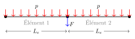{.nostretch fig-align="center" width="640"}

$$\bm f_{\text{nodale}}=-\begin{pmatrix}0\\0\\F\\0\\0\\0\end{pmatrix},\qquad
\bm f=-\begin{pmatrix}\frac{pL_e}{2}\\ \frac{pL_e^2}{12}\\ pL_e+F\\ 0\\ \frac{pL_e}{2}\\ -\frac{pL_e^2}{12}\end{pmatrix}$$

## Algorithme d'assemblage

```
Entrée : maillage
Sortie : matrice de rigidité globale K, vecteur de forces global f

K ← 0 ;  f ← 0
pour chaque élément e :
    Ke, fe ← rigidité élémentaire et forces réparties de e
    récupérer la connectivité de e (tableau local → global)
    pour chaque paire de ddl locaux (m, n) de e :
        i ← local2global(m) ;  j ← local2global(n)
        K[i, j] += Ke[m, n]
        f[i]    += fe[m]
f ← f + f_nodale
retourner K, f
```

::: {.remarque}
La matrice $\bm K$ est **creuse** et à bande : un nœud ne « voit » que ses voisins. On ne stocke jamais la matrice pleine pour de grands maillages.
:::

## Conditions aux limites

:::: {.columns}
::: {.column width="40%"}
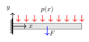{fig-align="center" width="400"}
:::
::: {.column width="60%"}
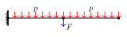{fig-align="center" width="640"}
:::
::::

Sachant que $v_1=0$ et $\phi_1=0$, on résout
$$\bm K\,\bm q=\bm f,\qquad\bm q=\begin{pmatrix}0&0&v_2&\phi_2&v_3&\phi_3\end{pmatrix}^\top$$

::: {.bloc .alerte}
**Si l'on ne bloque pas les mouvements rigides, $\bm K$ n'est pas inversible** (son noyau contient la translation et la rotation).
:::

## Application des conditions aux limites {.smaller}

On sépare les ddl bloqués $\bm q_b=(v_1,\phi_1)^\top$ et libres $\bm q_l=(v_2,\phi_2,v_3,\phi_3)^\top$ :

$$
\begin{bmatrix}\bm K_{bb}&\bm K_{bl}\\\bm K_{lb}&\bm K_{ll}\end{bmatrix}
\begin{pmatrix}\bm q_b\\\bm q_l\end{pmatrix}=
\begin{pmatrix}\bm f_b+\bm r\\\bm f_l\end{pmatrix}
$$

- $\bm f_b=\bigl(\tfrac{pL_e}{2},\ \tfrac{pL_e^2}{12}\bigr)^\top$ : forces extérieures sur l'encastrement ;
- $\bm r=(F_1,M_1)^\top$ : **réactions** à l'encastrement.

## Résolution

::: {.bloc}
**1. Déplacements.** On résout d'abord pour $\bm q_l$ :
$$\bm q_l=\bm K_{ll}^{-1}\bigl(\bm f_l-\bm K_{lb}\bm q_b\bigr)=\bm K_{ll}^{-1}\bm f_l\qquad(\bm q_b=\bm 0)$$
:::

::: {.bloc .vert}
**2. Réactions.** Puis on les retrouve par
$$\bm r=\bm K_{bl}\,\bm q_l-\bm f_b$$
:::

## Simulation : poutre encastrée

::: {.pw data-widget="cantilever" data-show="defl,conv" data-n="2"}
:::

::: {.small .muted}
$L=1$ m, $EI=2\cdot10^5$ N·m². Réactions exactes ($pL+F$, $pL^2/2+Fa$) quel que soit le maillage ; erreur en $h^4$ pour $p$ ; **nulle** pour une force nodale seule.
:::

## Moment fléchissant : convergence plus lente

::: {.pw data-widget="cantilever" data-show="defl,moment" data-n="4"}
:::

::: {.remarque}
$M=EI\,v_h''$ est linéaire dans chaque élément et discontinu aux nœuds : les flèches convergent en $h^4$, mais **les moments en $h^2$**.
:::

# Dynamique

## Problème dynamique

Principe de d'Alembert : les forces d'inertie s'ajoutent au chargement,

$$EI\,\pdvn{4}{v}{x}=p+f_{\text{inertie}},\qquad f_{\text{inertie}}=-\rho S\,\pdvn{2}{v}{t}$$

::: {.fragment}
La formulation faible s'obtient en ajoutant le travail des forces d'inertie :

$$
\underbrace{\int_0^L EI\,\delta v''\,v''\,\d x}_{\delta E_f}=
\underbrace{-\int_0^L\rho S\,\delta v\,\ddot v\,\d x}_{\delta W_{\text{inertie}}}
+\underbrace{\delta v\,\widehat T\Big|_{\Gamma_T}+\delta v'\,\widehat M\Big|_{\Gamma_M}+\int_0^L\delta v\,p\,\d x}_{\delta W_{\text{ext}}}
$$
:::

## Formulation discrète {.smaller}

On substitue $v=\bm N\,\bm q_e(t)$ et $\delta v=\bm N\,\delta\bm q_e$ ; les ddl dépendent maintenant du temps :

$$\delta W_{\text{inertie}}=-\delta\bm q_e^\top\bm M_e\,\ddot{\bm q}_e,\qquad \bm M_e=\int_0^{L_e}\rho S\,\bm N^\top\bm N\,\d x$$

::: {.cle}
Matrice de masse élémentaire (**cohérente**) :
$$
\bm M_e=\frac{\rho S L_e}{420}
\begin{bmatrix}
156&22L_e&54&-13L_e\\
22L_e&4L_e^2&13L_e&-3L_e^2\\
54&13L_e&156&-22L_e\\
-13L_e&-3L_e^2&-22L_e&4L_e^2
\end{bmatrix}
$$
:::

L'assemblage de $\bm M$ est identique à celui de $\bm K$.

## Problème dynamique global

Système global sans forces :
$$\bm M\ddot{\bm q}+\bm K\bm q=\bm 0$$

Après élimination des ddl bloqués $\bm q_b=\bm 0$ :
$$\bm M_{ll}\,\ddot{\bm q}_l+\bm K_{ll}\,\bm q_l=\bm 0$$

::: {.remarque}
$\bm M_{ll}$ est symétrique **définie positive** ; $\bm K_{ll}$ l'est aussi une fois les mouvements rigides bloqués.
:::

## Analyse modale

::: {.bloc}
La décomposition modale est essentielle car les sollicitations extérieures ont souvent un contenu fréquentiel limité à une bande.
:::

On cherche une solution harmonique $\bm q(t)=\bm\phi\,e^{i\omega t}$ :
$$(\bm K_{ll}-\omega^2\bm M_{ll})\,\bm\phi=\bm 0,\qquad \bm K_{ll},\bm M_{ll}\in\mathbb R^{n\times n}$$

- Fréquences propres : $\det(\bm K_{ll}-\omega_i^2\bm M_{ll})=0$, $i=1,\dots,n$.
- Vecteurs propres : $(\bm K_{ll}-\omega_i^2\bm M_{ll})\,\bm\phi_i=\bm 0$.

::: {.remarque}
Pour une fréquence propre multiple, plusieurs vecteurs propres indépendants $\bm\phi_i$ correspondent à la même $\omega_i$.
:::

## Simulation : modes propres de la poutre

::: {.pw data-widget="modes" data-n="8"}
:::

::: {.small .muted}
$EI=2\cdot10^5$ N·m², $\rho S=0{,}78$ kg/m, $L=1$ m. Les fréquences EF sont **supérieures** aux exactes ; seule la première moitié du spectre est précise.
:::

## Propriétés des modes {.smaller}

::: {.bloc}
**Orthogonalité.** $\bm M$ et $\bm K$ sont symétriques, donc
$$\bm\phi_i^\top\bm M\,\bm\phi_j=0,\qquad\bm\phi_i^\top\bm K\,\bm\phi_j=0\qquad(i\ne j)$$
:::

Avec la normalisation $\bm\Phi=[\bm\phi_1\ \dots\ \bm\phi_n]$ :
$$\bm\Phi^\top\bm M\,\bm\Phi=\bm I,\qquad\bm\Phi^\top\bm K\,\bm\Phi=\bm\Omega^2=\operatorname{diag}(\omega_1^2,\dots,\omega_n^2)$$

::: {.fragment}
Dans la base modale $\bm q=\bm\Phi\,\bm\eta$, et après projection par $\bm\Phi^\top$ :
$$\ddot{\bm\eta}+\bm\Omega^2\bm\eta=\bm 0$$
:::

::: {.fragment}
**Interprétation physique** : les modes sont **découplés**, chacun est un oscillateur à un ddl.
:::

## Invariance des modes

::: {.bloc}
Un mode est un **espace invariant**. Si la condition initiale est une combinaison linéaire de modes
$$\bm q^0=\sum_{i\in I}\bm\phi_i\,\eta_i^0,$$
la solution du problème dynamique reste décrite par les mêmes modes :
$$\bm q(t)=\sum_{i\in I}\bm\phi_i\,\eta_i(t).$$
:::

## Simulation : invariance des modes

::: {.pw data-widget="modalsum"}
:::

::: {.small .muted}
Avec $c_1$ seul ($\bm q^0=\bm\phi_1$), la forme reste **la même**. Ajoutez $c_2$ ou $c_3$ : la forme évolue car $\omega_2/\omega_1\approx6{,}3$.
:::

## Preuve de l'invariance

Espace propre : $E_i:=\{\bm\phi\neq\bm 0\ |\ \bm K\bm\phi=\omega_i^2\bm M\bm\phi\}$.

::: {.cle}
Si $\bm q(0),\dot{\bm q}(0)\in E_i$, alors $\bm q(t)\in E_i$ pour tout $t\ge0$.
:::

**Preuve.**

- Écrire $\bm q(t)=\bm\phi_i\,\eta_i(t)+\sum_{j\ne i}\bm\phi_j\,\eta_j(t)$ avec $\bm\phi_i\in E_i$, $\bm\phi_j\in E_j$.
- Avec $\bm K\bm\phi_i=\omega_i^2\bm M\bm\phi_i$ et l'orthogonalité, on obtient des équations découplées :
$$
\begin{aligned}
\ddot\eta_i+\omega_i^2\eta_i&=0, & \eta_i(0)&=\eta_i^0,\ \dot\eta_i(0)=\dot\eta_i^0,\\
\ddot\eta_j+\omega_j^2\eta_j&=0, & \eta_j(0)&=0,\ \dot\eta_j(0)=0.
\end{aligned}
$$
- D'où $\eta_j(t)\equiv0$ pour $j\ne i$ : le mouvement reste dans $E_i$. $\square$

## Réduction modale

Les modes permettent de réduire la taille du problème
$$\bm M\ddot{\bm q}+\bm K\bm q=\bm f$$
quand la sollicitation $\bm f$ a un contenu fréquentiel limité.

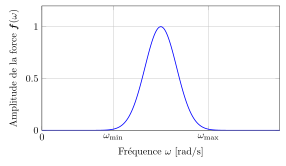{.nostretch fig-align="center" width="440"}

[Spectre d'une sollicitation limitée à la bande $[\omega_{\min},\omega_{\max}]$]{.small .muted}

## Système réduit {.smaller}

On retient $m<n$ modes pour approcher la solution :
$$\bm q\approx\bm\Phi_{[m]}\,\bm\eta_{[m]},\qquad\bm\Phi_{[m]}=\begin{bmatrix}\bm\phi_1&\dots&\bm\phi_m\end{bmatrix},\quad\bm\eta_{[m]}=(\eta_1,\dots,\eta_m)^\top$$

::: {.remarque}
NB : on n'est pas obligé de retenir les $m$ premières fréquences : on garde les modes qui **excitent la bande** de la sollicitation.
:::

On injecte dans la dynamique et on projette sur $\bm\Phi_{[m]}$. Avec $\bm K\bm\Phi_{[m]}=\bm M\bm\Phi_{[m]}\bm\Omega_{[m]}^2$ :

::: {.cle}
$$\ddot{\bm\eta}_{[m]}+\bm\Omega_{[m]}^2\,\bm\eta_{[m]}=\bm\Phi_{[m]}^\top\bm f$$
:::

[Système **découplé** de taille réduite : $m$ oscillateurs indépendants au lieu de $n$ équations couplées.]{.small .muted}

## Simulation : réduction modale

::: {.pw data-widget="frf"}
:::

::: {.small .muted}
Force et réponse en bout (40 ddl, $\zeta=0{,}5\,\%$). Courbe sombre : modèle complet ; verte : base réduite. Il faut garder **tous** les modes qui résonnent dans la bande orange.
:::

# À retenir

## Ce qu'il faut retenir

::: {.bloc}
**Statique.** Euler–Bernoulli $\Rightarrow$ $EI\,v''''=p$ ; forme faible $\delta E_f=\delta W_f$ ; conditions essentielles (cinématiques) imposées dans l'espace, naturelles (efforts) dans la forme faible.
:::

::: {.bloc .vert}
**Élément fini.** Interpolation d'Hermite ($C^1$), $\bm K_e=\int EI\,\bm B^\top\bm B\,\d x$, $\bm M_e=\int\rho S\,\bm N^\top\bm N\,\d x$ ; assemblage par sommation aux nœuds partagés ; sans conditions aux limites $\bm K$ est singulière.
:::

::: {.bloc}
**Dynamique.** $\bm M\ddot{\bm q}+\bm K\bm q=\bm f$ ; modes propres orthogonaux $\Rightarrow$ oscillateurs découplés, sous-espaces invariants ; réduction modale sur la bande de la sollicitation.
:::

## Pour aller plus loin

- G. Géradin & D. Rixen, *Mechanical Vibrations: Theory and Application to Structural Dynamics*, Wiley.
- T. J. R. Hughes, *The Finite Element Method: Linear Static and Dynamic Finite Element Analysis*, Dover.
- K.-J. Bathe, *Finite Element Procedures*, Prentice Hall.
- O. C. Zienkiewicz, R. L. Taylor & J. Z. Zhu, *The Finite Element Method: Its Basis and Fundamentals*, Butterworth-Heinemann.

::: {.remarque}
Le [laboratoire interactif](lab.qmd) reprend toutes les simulations de ces transparents en pleine page, et les [notes de cours](beam_bending.qmd) détaillent les calculs.
:::
